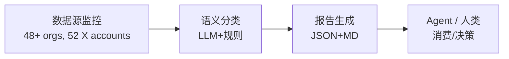

<div align="center">

# AI Dataset Radar

**面向 AI Agent 的训练数据竞争情报系统**  
**Competitive intelligence feed for AI training datasets (Agent-ready)**

[](LICENSE)
[](https://www.python.org/downloads/)
[](#agent-集成)
[](#mcp-server)

[快速开始](#快速开始) · [Agent 集成](#agent-集成) · [数据源](#数据源) · [输出规范](#输出规范) · [配置](#配置)

</div>

---

**GitHub Topics**: `ai-agent`, `competitive-intelligence`, `dataset-monitoring`, `mcp`, `function-calling`

监控 29 家 AI Labs、19 家数据供应商、38 个博客源、13 个 GitHub 组织、52 个 X/Twitter 账户的训练数据动态，提供结构化输出供智能体消费。支持 Function Calling、MCP、REST API 多种接入方式。

## 系统概述 / System Overview

```
多源采集 → 智能分类 → 结构化输出 → 智能体消费
```

### 运行全景 / End-to-end Flow



### 设计目标 / Design Goals

| 目标 | 实现方式 |
|------|----------|
| **智能体友好** | 标准化 JSON Schema、Function Calling 工具定义 |
| **多框架兼容** | HTTP API (LangChain)、MCP (Claude)、原生 SDK |
| **开箱即用** | 预置 System Prompt、完整类型定义 |
| **人机兼顾** | 同时输出 Markdown (人类) 与 JSON (智能体) |
| **环境原生 LLM** | `--insights` 模式利用 Claude Code/App 原生能力分析 |

### 适用场景 / Use Cases

| 使用者 | 接入方式 | 应用场景 |
|--------|----------|----------|
| 🤖 **LLM Agent** | Function Calling | 数据集发现、竞品分析自动化 |
| 🦜 **LangChain** | HTTP API | 构建数据情报 Agent |
| 💬 **Claude Desktop** | MCP Server | 自然语言交互式查询 |
| 🔧 **自定义系统** | REST API | 集成至现有工作流 |
| 👔 **决策者** | Markdown 报告 | 周报阅读、趋势把握 |

### 输出产物 / Deliverables

| 产物 | 路径 | 消费者 |
|------|------|--------|
| 情报报告 (JSON) | `data/reports/intel_report_*.json` | AI Agent |
| 情报报告 (MD) | `data/reports/intel_report_*.md` | 人类 |
| AI 分析报告 | `data/reports/intel_report_*_insights.md` | 决策层 |
| 分析提示词 | `data/reports/intel_report_*_insights_prompt.md` | LLM 输入 |
| 异常排查报告 | `data/reports/intel_report_*_anomalies.md` | 运维 |
| 工具定义 | `agent/tools.json` | Function Calling |
| 输出规范 | `agent/schema.json` | 数据验证 |
| 系统提示词 | `agent/prompts.md` | Agent 配置 |

---

## 安装部署 / Installation

```bash
git clone https://github.com/liuxiaotong/ai-dataset-radar.git
cd ai-dataset-radar
pip install -r requirements.txt

# 可选：Agent API 服务
pip install fastapi uvicorn
```

### 配置与调度 / Configuration & Scheduling

```bash
cp .env.example .env

# 关键变量
DATA_SOURCES=github,huggingface,arxiv
ANTHROPIC_API_KEY=sk-ant-...
OPENAI_API_KEY=sk-oai-...
REPORT_DAYS=7                     # 默认扫描区间
INSIGHTS_MODEL=claude-3-5-sonnet  # `--insights` 使用的模型
```

- GitHub/HF Token：用于访问私有数据源或提升 API 限额。
- `DATA_SOURCES`：逗号分隔控制采集范围，禁用特定源时也能减少速率限制。
- 调度建议：`crontab -e` 中加入 `0 */6 * * * /usr/bin/python src/main_intel.py --days 7`，即可每 6 小时刷新一次。

## 快速开始 / Quick Start

### 执行扫描 / Run a Scan

```bash
# 基础扫描
python src/main_intel.py --days 7

# 带 AI 分析（在 Claude Code / Claude App 中运行）
python src/main_intel.py --days 7 --insights
```

`--insights` 模式会输出数据 + 分析提示，由环境中的 LLM 自动完成竞争情报分析并保存。

**产出文件：**
```
data/reports/
├── intel_report_2026-02-07.json                # 结构化数据 (Agent)
├── intel_report_2026-02-07.md                  # 原始报告 (人类)
├── intel_report_2026-02-07_insights_prompt.md  # 分析提示 (LLM 输入)
├── intel_report_2026-02-07_insights.md         # AI 分析报告 (决策层)
└── intel_report_2026-02-07_anomalies.md        # 异常排查报告 (运维)
```

### 启动 API 服务 / Start API Service

```bash
uvicorn agent.api:app --port 8080
# 接口文档: http://localhost:8080/docs
```

### 智能体调用 / Agent Usage

```python
import requests
response = requests.get("http://localhost:8080/datasets?category=sft")
datasets = response.json()
```

---

## Agent 集成 / Agent Integrations

### 接入方式 / Integration Options

| 方式 | 适用框架 | 配置文件 |
|------|----------|----------|
| **HTTP API** | LangChain, AutoGPT, Dify | `agent/api.py` |
| **Function Calling** | OpenAI GPT, Claude API | `agent/tools.json` |
| **MCP Server** | Claude Desktop | `mcp_server/server.py` |
| **JSON Schema** | 类型生成、数据验证 | `agent/schema.json` |

### HTTP API 端点 / Endpoints

```bash
uvicorn agent.api:app --port 8080
```

| 端点 | 方法 | 功能 |
|------|------|------|
| `/summary` | GET | 获取最新报告摘要 |
| `/datasets` | GET | 数据集列表 (支持 category 筛选) |
| `/github` | GET | GitHub 仓库活动 (支持 relevance 筛选) |
| `/papers` | GET | 论文列表 (支持 dataset_only 筛选) |
| `/blogs` | GET | 博客文章 |
| `/scan` | POST | 执行新扫描 |
| `/schema` | GET | 输出规范 |
| `/tools` | GET | 工具定义 |

#### Claude MCP 配置示例 / Claude MCP Config

`~/Library/Application Support/Claude/claude_desktop_config.json`

```json
{
  "mcpServers": {
    "radar": {
      "command": "uv",
      "args": ["--directory", "/path/to/ai-dataset-radar", "run", "python", "mcp_server/server.py"],
      "env": {
        "RADAR_DATA_SOURCES": "github,huggingface",
        "RADAR_REPORT_DAYS": "7"
      }
    }
  }
}
```

> 常见问题：
> - `Tool invocation timed out` → 增大 `MCP_TIMEOUT` 或减小 `--days`。
> - `No insights model configured` → `.env` 中未设置 `INSIGHTS_MODEL` 或 `ANTHROPIC_API_KEY`。
> - `Permission denied writing data/reports` → 确保在项目根目录运行或设置 `RADAR_OUTPUT_DIR`。

### OpenAI Function Calling

```python
import json, openai

with open("agent/tools.json") as f:
    tools = json.load(f)["tools"]

response = openai.chat.completions.create(
    model="gpt-4o",
    messages=[{"role": "user", "content": "查询最新的偏好学习数据集"}],
    tools=[{"type": "function", "function": t} for t in tools]
)
```

### Anthropic Tool Use

```python
import json, anthropic

with open("agent/tools.json") as f:
    tools = json.load(f)["tools"]

response = anthropic.messages.create(
    model="claude-sonnet-4-20250514",
    tools=[{"name": t["name"], "description": t["description"],
            "input_schema": t["parameters"]} for t in tools],
    messages=[{"role": "user", "content": "查询合成数据集"}]
)
```

### LangChain 集成

```python
from langchain.tools import Tool
import requests

tools = [
    Tool(
        name="radar_datasets",
        func=lambda cat: requests.get(f"http://localhost:8080/datasets?category={cat}").json(),
        description="按类别查询数据集: sft|preference|synthetic|agent|code"
    ),
]
```

### 预置 System Prompt

`agent/prompts.md` 提供四类预置提示词：

| 角色 | 用途 |
|------|------|
| Dataset Intelligence Analyst | 数据集情报分析 |
| Competitive Intelligence Agent | 竞争情报追踪 |
| Dataset Discovery Assistant | 数据集发现与推荐 |
| Research Trend Monitor | 研究趋势监控 |

---

## MCP Server

配置 Claude Desktop (`~/Library/Application Support/Claude/claude_desktop_config.json`)：

```json
{
  "mcpServers": {
    "ai-dataset-radar": {
      "command": "/path/to/.venv/bin/python",
      "args": ["/path/to/mcp_server/server.py"]
    }
  }
}
```

| 工具 | 功能 |
|------|------|
| `radar_scan` | 执行完整扫描 |
| `radar_summary` | 获取报告摘要 |
| `radar_datasets` | 按类别查询数据集 |
| `radar_github` | 查询 GitHub 活动 |
| `radar_papers` | 查询论文 |
| `radar_blogs` | 查询博客文章 |
| `radar_config` | 获取监控配置 |

---

## 数据源

### 监控范围

| 来源 | 覆盖范围 |
|------|----------|
| **HuggingFace** | 29 AI Labs + 19 数据供应商：OpenAI, DeepMind, Meta, Anthropic, Qwen, DeepSeek, NVIDIA, Scale AI, BAAI 等 |
| **博客** | 38 来源：OpenAI, Anthropic (Research/News/Alignment/Red Team/API), Google AI, DeepMind, Mistral, Scale AI, Mercor, Surge AI, 海天瑞声, 整数智能, 智源 BAAI 等 |
| **GitHub** | 13 组织：openai, anthropics, deepseek-ai, argilla-io, scaleapi, meta-llama 等 |
| **论文** | arXiv (cs.CL/AI/LG) + HuggingFace Daily Papers |
| **X/Twitter** | 52 账户：前沿实验室、开源社区、评估基准、数据供应商、研究者与影响者 |

### 数据供应商分类

| 类别 | 覆盖 |
|------|------|
| **Premium（海外）** | Scale AI, Appen, Mercor, Invisible Technologies, TELUS Digital |
| **Specialized（海外）** | Surge AI, Snorkel AI, Labelbox, Turing, Prolific, Cohere for AI |
| **China Premium（中国）** | 海天瑞声, 整数智能 MolarData, 云测数据 Testin |
| **China Specialized（中国）** | 标贝科技 DataBaker, 数据堂 Datatang |
| **China Research（中国）** | 智源研究院 BAAI |

### X/Twitter 监控账户

通过 RSSHub（免费）或 X API v2 监控 52 个账户的数据集相关动态：

| 类别 | 账户 | 数量 |
|------|------|------|
| **前沿实验室** | OpenAI, AnthropicAI, GoogleDeepMind, GoogleAI, MetaAI, AIatMeta, xai, NVIDIAAI | 8 |
| **新兴实验室** | MistralAI, CohereForAI, AI21Labs, togethercompute, StabilityAI, databricks, NousResearch, UnslothAI, LiquidAI_ | 9 |
| **研究/开源** | EleutherAI, huggingface, allen_ai, lmsys_org, EpochAIResearch | 5 |
| **中国实验室** | Alibaba_Qwen, deepseek_ai, ZhipuAI, Baichuan_Inc, 01AI_Yi, Kimi_Moonshot, MiniMax__AI, intern_lm, StepFun_ai | 9 |
| **数据供应商** | scale_AI, surge_ai, ArgillaIO, SnorkelAI, LabelBox, weights_biases, EvidentlyAI | 7 |
| **评估/基准** | lmarena_ai, ArtificialAnlys, livebench_ai, arcprize | 4 |
| **研究者/影响者** | karpathy, ylecun, jimfan, natolambert, lvwerra, ClementDelangue, percyliang, Teknium1, maximelabonne, danielhanchen, rasbt, AndrewYNg, mmitchell_ai, _jasonwei, rohanpaul_ai | 15 |

信号关键词自动过滤：dataset, training data, benchmark, RLHF, synthetic data, fine-tuning 等。

### 数据集分类体系

| 类别 | 关键词 | 典型数据集 |
|------|--------|-----------|
| **sft** | instruction, chat | Alpaca, ShareGPT |
| **preference** | rlhf, dpo | UltraFeedback, HelpSteer |
| **reward_model** | reward, rationale | RationaleRM |
| **synthetic** | synthetic, generated | Magpie, Sera |
| **agent** | tool, function | SWE-bench, WebArena |
| **multimodal** | image, video | LLaVA, Action100M |
| **multilingual** | multilingual, speech | WaxalNLP, EuroLLM |
| **rl_environment** | reinforcement, simulation | ToucHD, RoboCasa |
| **code** | code, programming | StarCoder |

---

## 输出规范

### JSON Schema

完整规范见 `agent/schema.json`，核心结构：

```json
{
  "generated_at": "2026-02-07T14:22:03",
  "summary": {
    "total_datasets": 14,
    "total_github_repos": 136,
    "total_papers": 22,
    "total_blog_posts": 93
  },
  "datasets": [{
    "id": "allenai/Dolci-Instruct-SFT",
    "category": "sft_instruction",
    "downloads": 2610,
    "languages": ["en", "zh"],
    "license": "odc-by"
  }],
  "github_repos": [{
    "name": "open-instruct",
    "stars": 1500,
    "relevance": "high"
  }],
  "papers": [{
    "title": "...",
    "is_dataset_paper": true
  }],
  "blog_posts": [{
    "source": "OpenAI Blog",
    "articles": [{"title": "...", "url": "..."}]
  }]
}
```

---

## 配置

编辑 `config.yaml`：

```yaml
watched_orgs:
  frontier_labs:
    openai: { hf_ids: ["openai"] }
    google_deepmind: { hf_ids: ["google", "deepmind"] }
  # emerging_labs, research_labs, china_labs...

watched_vendors:
  premium:
    scale_ai: { name: "Scale AI", hf_ids: ["ScaleAI"] }
    mercor: { name: "Mercor", hf_ids: ["mercor"] }
  # specialized, china_premium, china_specialized, china_research...

  blogs:
    - name: "OpenAI Blog"
      url: "https://openai.com/blog"
    - name: "Anthropic Research"
      url: "https://www.anthropic.com/research"
    - name: "海天瑞声 SpeechOcean"
      url: "https://www.haitianruisheng.com/aboutus/news/catid-23.htm"
    # ... 38 sources total

priority_data_types:
  preference: { keywords: ["rlhf", "dpo"] }
  sft: { keywords: ["instruction", "chat"] }
```

---

## 系统架构

```
ai-dataset-radar/
├── src/                        # 核心模块
│   ├── main_intel.py           # 主入口（扫描 + insights 提示生成）
│   ├── trackers/               # 数据追踪器
│   │   ├── org_tracker.py      # HuggingFace 组织追踪
│   │   ├── blog_tracker.py     # 博客监控（RSS/HTML/Playwright）
│   │   ├── github_tracker.py   # GitHub 组织活动
│   │   ├── x_tracker.py        # X/Twitter 账户监控（RSSHub / API）
│   │   └── paper_tracker.py    # arXiv + HF Papers
│   ├── analyzers/              # 分类器
│   └── utils/                  # 工具库
├── agent/                      # Agent 集成层
│   ├── api.py                  # REST API
│   ├── tools.json              # 工具定义
│   ├── schema.json             # 输出规范
│   └── prompts.md              # 系统提示词
├── mcp_server/                 # MCP 服务
├── config.yaml                 # 监控配置（组织/供应商/博客/关键词）
└── data/reports/               # 输出目录
```

---

## 与 DataRecipe 协同

```
Radar (情报采集) → DataRecipe (逆向分析) → 复刻生产
```

联合配置实现端到端工作流：

```json
{
  "mcpServers": {
    "ai-dataset-radar": { "command": "..." },
    "datarecipe": { "command": "..." }
  }
}
```

---

## 开发路线

- [x] 多源数据采集 (HuggingFace, GitHub, arXiv, Blogs)
- [x] 双格式输出 (Markdown + JSON)
- [x] Agent 集成层 (HTTP API, Function Calling, Schema)
- [x] MCP Server (7 工具)
- [x] 插件化采集器 (9 个)
- [x] 性能优化 (并行采集、缓存、连接池)
- [x] 测试覆盖 (198 用例)
- [x] 博客抓取多策略降级 (RSS → HTML → Playwright, networkidle → domcontentloaded)
- [x] 中国数据供应商监控 (海天瑞声、整数智能、数据堂、智源 BAAI)
- [x] X/Twitter 监控 (52 账户，RSSHub/API 双后端，信号关键词过滤)
- [x] Insights 分析提示生成 (`--insights` 模式)
- [x] 异常报告独立输出
- [ ] 定时任务与告警
- [ ] Web 可视化界面

---

## 许可证

[MIT](LICENSE)

---

<div align="center">

**面向 AI Agent 的训练数据竞争情报系统**

</div>
