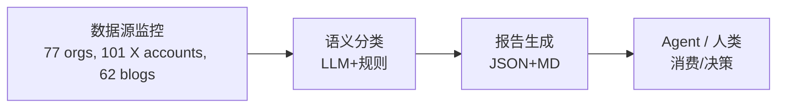
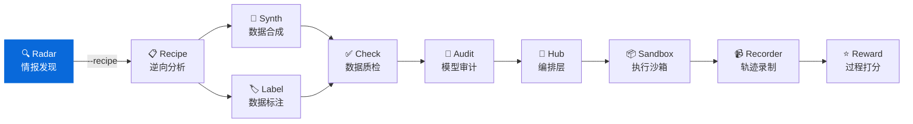
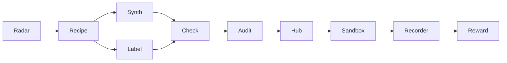

<div align="center">

# AI Dataset Radar

**面向 AI Agent 的训练数据竞争情报系统**  
**Competitive intelligence feed for AI training datasets (Agent-ready)**

[](https://github.com/liuxiaotong/ai-dataset-radar/actions/workflows/ci.yml)
[](LICENSE)
[](https://www.python.org/downloads/)
[](#开发路线)
[](#agent-集成)
[](#mcp-server)

[快速开始](#快速开始) · [Agent 集成](#agent-集成) · [数据源](#数据源) · [输出规范](#输出规范) · [配置](#配置)

</div>

---

**GitHub Topics**: `ai-agent`, `competitive-intelligence`, `dataset-monitoring`, `mcp`, `function-calling`

监控 50 家 AI Labs、27 家数据供应商、62 个博客源、15 个 GitHub 组织、101 个 X/Twitter 账户的训练数据动态，提供结构化输出供智能体消费。支持 Function Calling、MCP、REST API 多种接入方式。

## 系统概述 / System Overview

```
多源采集 → 时间归一 → 智能分类 → 结构化输出 → 智能体消费
```

### 运行全景 / End-to-end Flow



### 设计目标 / Design Goals

| 目标 | 实现方式 |
|------|----------|
| **智能体友好** | 标准化 JSON Schema、Function Calling 工具定义 |
| **多框架兼容** | HTTP API (LangChain)、MCP (Claude)、原生 SDK |
| **开箱即用** | 预置 System Prompt、完整类型定义 |
| **人机兼顾** | 同时输出 Markdown (人类) 与 JSON (智能体) |
| **高性能异步** | 全链路 aiohttp + asyncio.gather，400+ 请求并发执行 (CLI 与 API 一致) |
| **时间感知** | 数据集/模型/论文全链路采集并展示发布日期 |
| **生产就绪** | Docker 部署、CI 流水线、723 测试用例、配置校验 |
| **环境原生 LLM** | `--insights` 模式利用 Claude Code/App 原生能力分析 |
| **Skill 驱动** | 7 个 Claude Code Skills 覆盖采集→查询→分析→深潜完整工作流 |

### 适用场景 / Use Cases

| 使用者 | 接入方式 | 应用场景 |
|--------|----------|----------|
| 🤖 **LLM Agent** | Function Calling | 数据集发现、竞品分析自动化 |
| 🦜 **LangChain** | HTTP API | 构建数据情报 Agent |
| 💬 **Claude Desktop** | MCP Server | 自然语言交互式查询 |
| 🔧 **自定义系统** | REST API | 集成至现有工作流 |
| 👔 **决策者** | Markdown 报告 | 周报阅读、趋势把握 |

### 输出产物 / Deliverables

| 产物 | 路径 | 消费者 |
|------|------|--------|
| 情报报告 (JSON) | `data/reports/YYYY-MM-DD/intel_report_*.json` | AI Agent |
| 情报报告 (MD) | `data/reports/YYYY-MM-DD/intel_report_*.md` | 人类 |
| AI 分析报告 | `data/reports/YYYY-MM-DD/intel_report_*_insights.md` | 决策层（含时间线） |
| 分析提示词 | `data/reports/YYYY-MM-DD/intel_report_*_insights_prompt.md` | LLM 输入 |
| 异常排查报告 | `data/reports/YYYY-MM-DD/intel_report_*_anomalies.md` | 运维 |
| 日报变化追踪 | `data/reports/YYYY-MM-DD/intel_report_*_changes.md` | 纵向对比 |
| Recipe 分析 | `data/reports/YYYY-MM-DD/recipe/` | 复刻评估 |
| 工具定义 | `agent/tools.json` | Function Calling |
| 输出规范 | `agent/schema.json` | 数据验证 |
| 系统提示词 | `agent/prompts.md` | Agent 配置 |

---

## 安装部署 / Installation

### pip 安装

```bash
git clone https://github.com/liuxiaotong/ai-dataset-radar.git
cd ai-dataset-radar
pip install -r requirements.txt

# 安装 Playwright 浏览器（博客抓取需要）
playwright install chromium

# 配置环境变量
cp .env.example .env
# 编辑 .env 填入你的 Token（详见 .env.example 中的说明）
```

> **注意**：扫描命令必须从项目根目录运行（`config.yaml` 所在目录）。
> 首次运行时程序会自动检测环境，缺少依赖会给出修复建议。

### Docker 部署

```bash
# 运行一次扫描
docker compose run scan

# 启动 API 服务
docker compose up api -d
# API: http://localhost:8080/docs
```

环境变量通过 `.env` 文件或 `docker compose` 的 `environment` 传入（完整说明见 `.env.example`）：

| 变量 | 必需 | 作用 |
|------|------|------|
| `GITHUB_TOKEN` | 推荐 | GitHub API 速率 60→5000 req/hr |
| `ANTHROPIC_API_KEY` | 可选 | 自动生成 AI 分析报告 |
| `RADAR_API_KEY` | 可选 | REST API 认证密钥 |

### X/Twitter 数据源设置（RSSHub）

X/Twitter 监控依赖 RSSHub 将推文转为 RSS。推荐自托管以获得最佳稳定性：

```bash
# 1. 启动 RSSHub Docker（需要 Twitter 登录 Cookie）
#    获取 Cookie：浏览器登录 x.com → F12 → Application → Cookies → auth_token
docker run -d --name rsshub -p 1200:1200 \
  -e TWITTER_AUTH_TOKEN=<your_auth_token> \
  diygod/rsshub

# 2. 验证
curl "http://localhost:1200/twitter/user/karpathy"
```

config.yaml 中已预配置本地实例 + 公共实例 fallback：
```yaml
x_tracker:
  backend: auto           # auto | rsshub | api
  rsshub_urls:            # 按顺序尝试，第一个成功即使用
    - "http://localhost:1200"       # 自托管（推荐）
    - "https://rsshub.app"         # 公共实例（可能不稳定）
```

### 配置与调度 / Configuration & Scheduling

项目使用 `python-dotenv` 自动加载项目根目录的 `.env` 文件，无需手动 `export`：

```bash
# .env 关键变量（参见 .env.example）
ANTHROPIC_API_KEY=sk-ant-...        # 用于自动生成 insights 报告（可选）
GITHUB_TOKEN=ghp_...                # 提升 GitHub API 限额（可选）
```

- `ANTHROPIC_API_KEY`：设置后 CLI 和 API 路径均自动生成 insights 报告。
- `GITHUB_TOKEN`：用于访问私有数据源或提升 API 限额。
- 调度建议：`crontab -e` 中加入 `0 */6 * * * /usr/bin/python src/main_intel.py --days 7`，即可每 6 小时刷新一次。

## 快速开始 / Quick Start

### 执行扫描 / Run a Scan

```bash
# 基础扫描（默认自动生成 AI 分析报告）
python src/main_intel.py --days 7

# 扫描 + 自动衔接 DataRecipe 深度分析（Top 5 数据集）
python src/main_intel.py --days 7 --recipe

# 指定分析数量
python src/main_intel.py --days 7 --recipe --recipe-limit 3

# 跳过 AI 分析
python src/main_intel.py --days 7 --no-insights
```

**AI 分析报告自动生成**：扫描完成后自动调用 Anthropic API 生成竞争情报分析报告（含关键发现、组织图谱、需求信号、行动建议、时间线 5 个章节）。

| 环境 | 行为 |
|------|------|
| 有 `ANTHROPIC_API_KEY` | 自动调用 API 生成 `_insights.md`（CLI 与 API 路径均支持） |
| 无 API key（CLI） | 保存 prompt 文件，日志提示路径，供 Claude Code 等 AI CLI 读取分析 |
| `--no-insights` | 跳过 insights 逻辑 |

**产出文件（按日期子目录组织）：**
```
data/reports/2026-02-08/
├── intel_report_2026-02-08.json                # 结构化数据 (Agent)
├── intel_report_2026-02-08.md                  # 原始报告 (人类)
├── intel_report_2026-02-08_insights_prompt.md  # 分析提示 (LLM 输入)
├── intel_report_2026-02-08_insights.md         # AI 分析报告 (决策层)
├── intel_report_2026-02-08_anomalies.md        # 异常排查报告 (运维)
├── intel_report_2026-02-08_changes.md          # 日报变化追踪 (纵向对比)
└── recipe/                                     # DataRecipe 深度分析 (--recipe)
    ├── recipe_analysis_summary.md
    ├── aggregate_summary.json
    └── Anthropic__hh-rlhf/                     # 每个数据集 23+ 文件
```

### 启动仪表盘 / Start Dashboard

```bash
python agent/api.py
# 自动打开浏览器 → http://localhost:8080/dashboard
```

### 智能体调用 / Agent Usage

```python
import requests
response = requests.get("http://localhost:8080/datasets?category=sft")
datasets = response.json()
```

---

## Agent 集成 / Agent Integrations

### 接入方式 / Integration Options

| 方式 | 适用框架 | 配置文件 |
|------|----------|----------|
| **HTTP API** | LangChain, AutoGPT, Dify | `agent/api.py` |
| **Function Calling** | OpenAI GPT, Claude API | `agent/tools.json` |
| **MCP Server** | Claude Desktop | `mcp_server/server.py` |
| **JSON Schema** | 类型生成、数据验证 | `agent/schema.json` |

### HTTP API 端点 / Endpoints

```bash
uvicorn agent.api:app --port 8080
```

| 端点 | 方法 | 功能 |
|------|------|------|
| `/dashboard` | GET | Web 可视化仪表盘（5 视图） |
| `/ui` | GET | 重定向至仪表盘 |
| `/health` | GET | 健康检查（认证状态、报告可用性） |
| `/summary` | GET | 获取最新报告摘要 |
| `/datasets` | GET | 数据集列表 (支持 category 筛选) |
| `/github` | GET | GitHub 仓库活动 (支持 relevance 筛选) |
| `/papers` | GET | 论文列表 (支持 dataset_only 筛选) |
| `/blogs` | GET | 博客文章 (支持 category/source 筛选) |
| `/scan` | POST | 执行新扫描（含 insights 生成） |
| `/config` | GET | 监控配置（敏感信息自动脱敏） |
| `/schema` | GET | 输出规范 |
| `/tools` | GET | 工具定义 |

#### Claude MCP 配置示例 / Claude MCP Config

`~/Library/Application Support/Claude/claude_desktop_config.json`

```json
{
  "mcpServers": {
    "radar": {
      "command": "uv",
      "args": ["--directory", "/path/to/ai-dataset-radar", "run", "python", "mcp_server/server.py"],
      "env": {
        "RADAR_DATA_SOURCES": "github,huggingface",
        "RADAR_REPORT_DAYS": "7"
      }
    }
  }
}
```

> 常见问题：
> - `Tool invocation timed out` → 增大 `MCP_TIMEOUT` 或减小 `--days`。
> - `No insights model configured` → `.env` 中未设置 `INSIGHTS_MODEL` 或 `ANTHROPIC_API_KEY`。
> - `Permission denied writing data/reports` → 确保在项目根目录运行或设置 `RADAR_OUTPUT_DIR`。

### OpenAI Function Calling

```python
import json, openai

with open("agent/tools.json") as f:
    tools = json.load(f)["tools"]

response = openai.chat.completions.create(
    model="gpt-4o",
    messages=[{"role": "user", "content": "查询最新的偏好学习数据集"}],
    tools=[{"type": "function", "function": t} for t in tools]
)
```

### Anthropic Tool Use

```python
import json, anthropic

with open("agent/tools.json") as f:
    tools = json.load(f)["tools"]

response = anthropic.messages.create(
    model="claude-sonnet-4-20250514",
    tools=[{"name": t["name"], "description": t["description"],
            "input_schema": t["parameters"]} for t in tools],
    messages=[{"role": "user", "content": "查询合成数据集"}]
)
```

### LangChain 集成

```python
from langchain.tools import Tool
import requests

tools = [
    Tool(
        name="radar_datasets",
        func=lambda cat: requests.get(f"http://localhost:8080/datasets?category={cat}").json(),
        description="按类别查询数据集: sft_instruction|reward_model|synthetic|multimodal|code|evaluation"
    ),
]
```

### 预置 System Prompt

`agent/prompts.md` 提供四类预置提示词：

| 角色 | 用途 |
|------|------|
| Dataset Intelligence Analyst | 数据集情报分析 |
| Competitive Intelligence Agent | 竞争情报追踪 |
| Dataset Discovery Assistant | 数据集发现与推荐 |
| Research Trend Monitor | 研究趋势监控 |

---

## MCP Server

配置 Claude Desktop (`~/Library/Application Support/Claude/claude_desktop_config.json`)：

```json
{
  "mcpServers": {
    "ai-dataset-radar": {
      "command": "/path/to/.venv/bin/python",
      "args": ["/path/to/mcp_server/server.py"]
    }
  }
}
```

| 工具 | 功能 | 参数 |
|------|------|------|
| `radar_scan` | 执行完整扫描 | `sources` |
| `radar_summary` | 报告摘要 | |
| `radar_datasets` | 按类别查询数据集 | `category`, `org` |
| `radar_github` | GitHub 活动 | `org` |
| `radar_papers` | 论文列表 | |
| `radar_blogs` | 博客文章 | |
| `radar_config` | 监控配置 | |
| `radar_search` | 全文搜索（跨 5 源，支持正则） | `query`, `sources`, `limit` |
| `radar_diff` | 报告对比（新增/消失项） | `date_a`, `date_b` |
| `radar_trend` | 趋势分析（增长/突破） | `mode`, `dataset_id`, `days` |
| `radar_history` | 历史时间线 | `limit` |

---

## Claude Code Skills

在 Claude Code 中输入 `/` 即可调用，覆盖完整的竞争情报工作流：

| 命令 | 用途 | 类型 | 是否联网 |
|------|------|------|----------|
| `/scan` | 运行扫描 + 自动生成 AI 分析报告 | 采集 | 是 |
| `/brief` | 快速情报简报（5 条发现 + 行动建议） | 阅读 | 否 |
| `/search 关键词` | 跨 5 源搜索（数据集/GitHub/论文/博客/X） | 查询 | 否 |
| `/diff` | 对比两次报告（新增/消失/变化） | 对比 | 否 |
| `/deep-dive 目标` | 组织/数据集/分类深度分析 | 分析 | 否 |
| `/recipe 数据集ID` | DataRecipe 逆向分析（成本/Schema/难度） | 深潜 | 是 |
| `/radar` | 通用情报助手（路由到其他 Skill） | 入口 | — |

### 典型工作流

```bash
# 1. 每周采集（自动分析 + DataRecipe Top 5）
/scan --days 7 --recipe

# 2. 晨会快速浏览
/brief

# 3. 按主题搜索
/search RLHF
/search 机器人数据集

# 4. 聚焦某组织
/deep-dive NVIDIA

# 5. 深入某数据集
/recipe allenai/Dolci-Instruct-SFT

# 6. 周对比变化
/diff
```

### Skill 设计原则

- **环境 LLM 接管**：当 `ANTHROPIC_API_KEY` 未设置时，`/scan` 会让 Claude Code 自身作为分析引擎生成 insights 报告
- **纯本地读取**：`/brief`、`/search`、`/diff`、`/deep-dive` 不触发网络请求，只解析本地 JSON 报告
- **交叉引用**：每个 Skill 的输出中会推荐相关的后续 Skill（如 `/search` 结果建议 `/deep-dive`）

---

## 数据源

### 监控范围

| 来源 | 数量 | 覆盖 |
|------|-----:|------|
| **HuggingFace** | 77 orgs | 50 Labs + 27 供应商 |
| **博客** | 62 源 | 实验室 + 研究者 + 独立博客 |
| **GitHub** | 15 orgs | openai, deepseek-ai, NVIDIA 等 |
| **论文** | 2 源 | arXiv (cs.CL/AI/LG) + HF Papers |
| **X/Twitter** | 101 账户 | 9 类别，RSSHub 自托管 + fallback |

### 数据供应商分类

| 类别 | 覆盖 |
|------|------|
| **Premium（海外）** | Scale AI, Appen, Mercor, Invisible Technologies, TELUS Digital |
| **Specialized（海外）** | Surge AI, Snorkel AI, Labelbox, Turing, Prolific, Cohere for AI |
| **China Premium（中国）** | 海天瑞声, 整数智能 MolarData, 云测数据 Testin |
| **China Specialized（中国）** | 标贝科技 DataBaker, 数据堂 Datatang |
| **China Research（中国）** | 智源研究院 BAAI |

### X/Twitter 监控账户

通过自托管 RSSHub（推荐）或 X API v2 监控 98 个账户。多 RSSHub 实例自动 fallback + 连续失败阈值保护。

| 类别 | 数量 | 代表账户 |
|------|-----:|----------|
| 前沿实验室 | 8 | OpenAI, AnthropicAI, GoogleDeepMind, MetaAI, NVIDIAAI |
| 新兴/开源 | 12 | MistralAI, CohereForAI, StabilityAI, NousResearch |
| 研究/开源 | 5 | AiEleuther, huggingface, allen_ai, lmsysorg |
| 中国实验室 | 14 | Alibaba_Qwen, deepseek_ai, BaichuanAI, Kimi_Moonshot |
| 亚太/欧洲 | 11 | SakanaAILabs, NAVER_AI_Lab, laion_ai, StanfordHAI |
| 数据供应商 | 9 | scale_AI, HelloSurgeAI, argilla_io, LabelBox |
| 基准/MLOps | 7 | lmarena_ai, ArtificialAnlys, kaggle, modal_labs |
| 安全/对齐 | 4 | ai_risks, JaredKaplan |
| 研究者 | 31 | karpathy, ylecun, jimfan, emollick, Hesamation |

信号关键词过滤：dataset, training data, benchmark, RLHF, synthetic data, fine-tuning 等。完整列表见 `config.yaml`。

### 数据集分类体系

多维评分分类：关键词(+1) + 名称模式(+2) + 字段模式(+2) + 标签(+3)，阈值 ≥ 2 分。

| 类别 | 关键词示例 | 典型数据集 |
|------|-----------|-----------|
| **sft** | instruction, chat, dialogue | Alpaca, ShareGPT |
| **preference** | rlhf, dpo, chosen/rejected | UltraFeedback, HelpSteer |
| **reward_model** | reward, ppo | RationaleRM |
| **synthetic** | synthetic, distillation | Magpie, Sera |
| **agent** | tool use, function calling | SWE-bench, WebArena |
| **multimodal** | image, video, audio, speech, OCR, document, CLIP | LLaVA, Numb3rs, doc_split |
| **multilingual** | multilingual, translation | WaxalNLP, EuroLLM |
| **rl_environment** | robot, embodied, haptic, simulation | RoboCasa, ToucHD, LIBERO |
| **code** | programming, verification, proof | StarCoder, Verus |
| **evaluation** | benchmark, safety guard, control task | Nemotron-Safety |

---

## 输出规范

### JSON Schema

完整规范见 `agent/schema.json`，核心结构：

```json
{
  "generated_at": "2026-02-07T14:22:03",
  "summary": {
    "total_datasets": 14,
    "total_github_orgs": 14,
    "total_github_repos": 136,
    "total_github_repos_high_relevance": 80,
    "total_papers": 22,
    "total_blog_posts": 93,
    "total_x_tweets": 47,
    "total_trending_datasets": 5
  },
  "datasets": [{
    "id": "allenai/Dolci-Instruct-SFT",
    "category": "sft_instruction",
    "created_at": "2025-11-18T00:00:00.000Z",
    "last_modified": "2026-02-03T12:34:56.000Z",
    "downloads": 2610,
    "growth_7d": 0.35,
    "growth_30d": 1.2,
    "languages": ["en", "zh"],
    "license": "odc-by"
  }],
  "github_activity": [{
    "org": "openai",
    "repos_count": 12,
    "repos_updated": [{
      "name": "open-instruct",
      "full_name": "openai/open-instruct",
      "stars": 1500,
      "relevance": "high",
      "relevance_signals": ["dataset", "instruction"]
    }]
  }],
  "papers": [{
    "title": "...",
    "created_at": "2026-02-04T16:53:47",
    "source": "arxiv",
    "is_dataset_paper": true
  }],
  "blog_posts": [{
    "source": "OpenAI Blog",
    "articles": [{"title": "...", "url": "...", "date": "2026-02-05", "summary": "..."}]
  }],
  "x_activity": {
    "accounts": [{
      "username": "karpathy",
      "relevant_tweets": [{"text": "...", "url": "...", "date": "2026-02-06"}]
    }]
  }
}
```

---

## 配置

编辑 `config.yaml`：

```yaml
watched_orgs:
  frontier_labs:
    openai: { hf_ids: ["openai"] }
    google_deepmind: { hf_ids: ["google", "deepmind"] }
  # emerging_labs, research_labs, china_labs...

watched_vendors:
  premium:
    scale_ai: { name: "Scale AI", hf_ids: ["ScaleAI"] }
    mercor: { name: "Mercor", hf_ids: ["mercor"] }
  # specialized, china_premium, china_specialized, china_research...

  blogs:
    - name: "OpenAI Blog"
      url: "https://openai.com/blog"
      category: us_frontier
    - name: "Anthropic Research"
      url: "https://www.anthropic.com/research"
      category: us_frontier
    - name: "海天瑞声 SpeechOcean"
      url: "https://www.haitianruisheng.com/aboutus/news/catid-23.htm"
      category: china
    # ... 62 sources (categories: us_frontier, us_emerging, china, research, data_vendor)

priority_data_types:
  preference: { keywords: ["rlhf", "dpo"] }
  sft: { keywords: ["instruction", "chat"] }
```

---

## 系统架构

```
ai-dataset-radar/
├── src/                        # 核心模块
│   ├── main_intel.py           # 主入口（async 编排 + 进度指示 + 趋势注入 + insights + --recipe）
│   ├── _version.py             # 版本号单一来源 (__version__)
│   ├── trackers/               # 数据追踪器（全异步 aiohttp）
│   │   ├── org_tracker.py      # HuggingFace 组织追踪
│   │   ├── blog_tracker.py     # 博客监控（RSS/HTML/Playwright async）
│   │   ├── github_tracker.py   # GitHub 组织活动
│   │   ├── x_tracker.py        # X/Twitter 账户监控（RSSHub / API）
│   │   └── paper_tracker.py    # arXiv + HF Papers
│   ├── scrapers/               # 数据采集器
│   ├── analyzers/              # 分类器 + 趋势分析 + change_tracker 日报变化追踪
│   └── utils/                  # 工具库
│       ├── async_http.py       # AsyncHTTPClient（连接池 + 重试 + 限速）
│       ├── llm_client.py       # LLM 调用（Anthropic API insights 生成）
│       └── cache.py            # FileCache（TTL + LRU 驱逐）
├── agent/                      # Agent 集成层
│   ├── api.py                  # REST API（认证 + 限速 + 健康检查）
│   ├── static/index.html       # Web 仪表盘（单文件，Tailwind + Chart.js）
│   ├── tools.json              # 工具定义
│   ├── schema.json             # 输出规范
│   └── prompts.md              # 系统提示词
├── .claude/commands/            # Claude Code Skills（7 个）
│   ├── scan.md                # /scan — 扫描 + 自动分析
│   ├── brief.md               # /brief — 快速情报简报
│   ├── search.md              # /search — 跨源智能搜索
│   ├── diff.md                # /diff — 报告对比
│   ├── deep-dive.md           # /deep-dive — 深度分析
│   ├── recipe.md              # /recipe — DataRecipe 逆向分析
│   └── radar.md               # /radar — 通用情报助手
├── mcp_server/                 # MCP 服务
├── .github/workflows/ci.yml    # CI：ruff lint + pytest
├── Dockerfile                  # 容器镜像（含 Playwright）
├── docker-compose.yml          # scan + api 服务编排
├── config.yaml                 # 监控配置（组织/供应商/博客/关键词）
├── .env.example                # 环境变量模板
└── data/reports/               # 输出目录（按日期子目录）
    └── YYYY-MM-DD/             # 每日报告 + recipe/ 分析结果
```

---

## 与 DataRecipe 协同



### 一键联动 / One-Command Pipeline

`--recipe` 参数让 Radar 扫描完成后**自动**挑选高价值数据集，调用 DataRecipe 深度分析：

```bash
# 扫描 → 智能评分 → 自动分析 Top 5 数据集
python src/main_intel.py --days 7 --recipe

# 前置：安装 DataRecipe（软依赖，未安装时自动跳过）
pip install -e /path/to/data-recipe
```

**智能评分公式（0-100）：**

| 维度 | 权重 | 说明 |
|------|------|------|
| 下载量 | max 25 | log10 缩放，覆盖 10~100k+ 量级 |
| 社区认可 | max 10 | sqrt(likes) 缩放，社区 star 越多分越高 |
| 信号强度 | max 18 | 有意义分类信号越多越优先 |
| 分类优先级 | max 20 | preference > reward > sft > code/agent > synthetic > ... |
| 新鲜度 | max 12 | ≤7 天 +12，≤14 天 +8，≤30 天 +4（渐进衰减） |
| 低下载惩罚 | ×0.5 | <50 次下载的数据集总分减半，过滤噪声 |

**输出位于同一日期目录下：**
```
data/reports/2026-02-08/
├── intel_report_2026-02-08.json    # Radar 报告
└── recipe/                         # DataRecipe 分析
    ├── recipe_analysis_summary.md  # 人类摘要
    ├── aggregate_summary.json      # 机器摘要（总复刻成本、难度分布）
    └── Anthropic__hh-rlhf/         # 每个数据集 23+ 分析文件
```

### MCP 双服务 / MCP Joint Config

Claude Desktop 中同时配置两个 MCP Server，可自然语言驱动端到端工作流：

```json
{
  "mcpServers": {
    "ai-dataset-radar": { "command": "..." },
    "datarecipe": { "command": "..." }
  }
}
```

| 层 | 项目 | 说明 | 仓库 |
|---|---|---|---|
| 情报 | **AI Dataset Radar** | 数据集竞争情报、趋势分析 | You are here |
| 分析 | **DataRecipe** | 逆向分析、Schema 提取、成本估算 | [GitHub](https://github.com/liuxiaotong/data-recipe) |
| 生产 | **DataSynth** | LLM 批量合成、种子数据扩充 | [GitHub](https://github.com/liuxiaotong/data-synth) |
| 生产 | **DataLabel** | 轻量标注工具、多标注员合并 | [GitHub](https://github.com/liuxiaotong/data-label) |
| 质检 | **DataCheck** | 规则验证、重复检测、分布分析 | [GitHub](https://github.com/liuxiaotong/data-check) |
| 质检 | **ModelAudit** | 蒸馏检测、模型指纹、身份验证 | [GitHub](https://github.com/liuxiaotong/model-audit) |
| Agent | **AgentSandbox** | Docker 执行沙箱、轨迹重放 | [GitHub](https://github.com/liuxiaotong/agent-sandbox) |
| Agent | **AgentRecorder** | 标准化轨迹录制、多框架适配 | [GitHub](https://github.com/liuxiaotong/agent-recorder) |
| Agent | **AgentReward** | 过程级 Reward、Rubric 多维评估 | [GitHub](https://github.com/liuxiaotong/agent-reward) |
| 编排 | **TrajectoryHub** | Pipeline 编排、数据集导出 | [GitHub](https://github.com/liuxiaotong/agent-trajectory-hub) |

---

## 开发路线

- [x] 多源数据采集 (HuggingFace, GitHub, arXiv, Blogs)
- [x] 双格式输出 (Markdown + JSON)
- [x] Agent 集成层 (HTTP API, Function Calling, Schema)
- [x] MCP Server (11 工具: scan/summary/datasets/github/papers/blogs/config/search/diff/trend/history)
- [x] 插件化采集器 (9 个)
- [x] 全链路异步 I/O (aiohttp + asyncio.gather 替代 requests + ThreadPoolExecutor，~2x 提速)
- [x] CI 流水线 (GitHub Actions: ruff lint + pytest, push/PR 触发)
- [x] Docker 容器化 (Dockerfile + docker-compose: scan 扫描 + api 服务)
- [x] 测试覆盖 (723 用例: API 65 + async_http 49 + blog_tracker 48 + intel_report 22 + MCP 86 + GitHub 44 + X 45 + Org 30 + change_tracker 15 + 其余 319)
- [x] 博客抓取多策略降级 (RSS → HTML → Playwright, networkidle → domcontentloaded)
- [x] 中国数据供应商监控 (海天瑞声、整数智能、数据堂、智源 BAAI)
- [x] X/Twitter 监控 (101 账户，9 类别，自托管 RSSHub + 多实例 fallback + 连续失败阈值保护)
- [x] Insights 分析提示生成 (`--insights` 模式)
- [x] 异常报告独立输出 (`_anomalies.md` 与 `_insights.md` 分离，工程信息不进管理层报告)
- [x] 分类器增强 (覆盖率 37%→84%：新增机器人/具身、文档理解、语音、形式化验证、安全评估等关键词)
- [x] X 账号自动修正 (5 个改名/格式错误账号修复，URL 日期提取防止旧博客文章泄漏)
- [x] 全链路指数退避重试 (HF/GitHub/RSSHub 5xx 自动恢复)
- [x] 数据质量校验 (各源 0 结果自动告警, JSON 输出 data_quality_warnings)
- [x] 博客噪声过滤 (nav/sidebar/footer 自动排除, 浏览器每 15 页重启)
- [x] API 安全加固 (Bearer Token 认证 + 速率限制 + 输入校验 + /health 端点 + /config 敏感信息脱敏)
- [x] datetime 全面修复 (21 处 utcnow() 替换为 timezone-aware)
- [x] 启动配置校验 (validate_config: 必需配置段 + 类型检查 + 缺失警告)
- [x] 缓存大小限制 (FileCache LRU 驱逐，max_entries=1000)
- [x] 时间信息全链路贯通 (HF camelCase→snake_case 归一化, HF Papers 页面 `<time>` 提取, insights 数据集/模型/论文均带日期, 新增时间线章节)
- [x] GitHub 加权相关性评分 (keyword×10 + stars/100 + 近 3 天活跃加成 - 噪声惩罚)
- [x] 研究者博客监控 (Lil'Log, fast.ai, Interconnects, LessWrong, Alignment Forum, The Gradient, Epoch AI)
- [x] radar_search 全文搜索 (跨 5 类数据源, 支持正则, 按来源过滤)
- [x] radar_diff 报告对比 (自动识别新增/消失的数据集、仓库、论文、博客)
- [x] 工具参数扩展 (radar_scan sources 过滤, radar_datasets/github org 过滤)
- [x] 趋势分析集成 (radar_trend 增长/上升/突破查询 + main_intel 每次扫描自动记录 daily_stats)
- [x] 历史时间线 (radar_history 跨期报告统计对比 + 趋势线)
- [ ] 定时任务与告警
- [x] Web 可视化仪表盘 (`/dashboard`: 概览/数据集/GitHub/论文/博客 5 视图，Chart.js 图表，深色主题，`python agent/api.py` 一键启动)
- [x] 博客抓取修复 (移除过度激进的信号关键词过滤，保留所有已监控 AI 实验室的博客文章)
- [x] MCP/Schema 数据管道修复 (X/Twitter 数据写入 JSON 报告, 博客搜索字段名修正, radar_papers source+dataset_only 过滤, schema.json 全面同步实际结构)
- [x] 博客分类标注 (config.yaml 62 个博客源添加 category 字段, BlogTracker 透传至 JSON, /blogs API 分类筛选生效)
- [x] 数据集分类对齐 (Dashboard 下拉菜单 + API 文档 + schema.json 枚举统一为 DataType: rlhf_preference/agent_tool 等 11 类)
- [x] API 扫描 X/Twitter 补全 (run_intel_scan 添加 XTracker 采集 + x_activity 写入报告，API 扫描与 CLI 数据一致)
- [x] Markdown 报告 X/Twitter 章节 (IntelReportGenerator 新增 _generate_x_section，CLI 与 API 报告均含推文动态)
- [x] Dashboard 筛选增强 (论文「仅数据集」复选框 + 博客分类下拉 + MCP radar_blogs category 参数)
- [x] 健壮性加固 (asyncio.get_running_loop 替代已弃用 API, open() 统一 UTF-8 编码, JSON 加载异常处理)
- [x] 全链路性能优化 (OrgTracker 组织内并行化, feedparser→线程池, 并发上限调优 blog25/x20/github15, 超时 30→20s/重试 3→2, X HEAD 跳过)
- [x] dotenv 环境变量支持 (python-dotenv 自动加载 .env, .env.example 模板)
- [x] Insights API 集成 (run_intel_scan API 路径复用 LLM insights 生成, 返回 insights 文本)
- [x] 报告按日期子目录组织 (`data/reports/YYYY-MM-DD/`, MCP/API 兼容新旧两种布局)
- [x] DataRecipe 自动衔接 (`--recipe` 智能评分选 Top N 数据集, 自动调用 DeepAnalyzerCore 深度分析, 输出聚合报告)
- [x] Recipe 评分公式优化 (新增 likes 社区认可维度, 降低类别权重占比, 渐进式新鲜度衰减, <50 下载半分门槛)
- [x] Claude Code Skills 深化 (7 个: scan/brief/search/diff/deep-dive/recipe/radar，覆盖采集→查询→分析→深潜完整工作流)
- [x] 自动日报变化追踪 (每次扫描后对比前日报告生成 `_changes.md`：总量变化 + 新增/消失数据集 + 下载/Star 变动 Top 5 + 分类分布 + 新论文)
- [x] 扫描进度指示 (`[1/N]...[N/N]` 步骤编号，动态计算总步骤数，gather 结果 ✓ 标记)
- [x] 趋势数据写入报告 (每个 dataset 注入 growth_7d/growth_30d, Markdown 增加「📈 数据集增长趋势」节, JSON 增加 featured_trends)
- [x] stdout 清理 (insights prompt 不再 dump 到终端，改为保存文件 + 日志提示路径)
- [x] 版本号统一管理 (`src/_version.py` 单一来源 + git pre-commit hook 自动 patch +1)

---

## AI Data Pipeline 生态

> 10 个工具覆盖 AI 数据工程全流程，均支持 CLI + MCP，可独立使用也可组合成流水线。

| Tool | Description | Link |
|------|-------------|------|
| **AI Dataset Radar** | Competitive intelligence for AI training datasets | You are here |
| **DataRecipe** | Reverse-engineer datasets into annotation specs & cost models | [GitHub](https://github.com/liuxiaotong/data-recipe) |
| **DataSynth** | Seed-to-scale synthetic data generation | [GitHub](https://github.com/liuxiaotong/data-synth) |
| **DataLabel** | Lightweight, serverless HTML labeling tool | [GitHub](https://github.com/liuxiaotong/data-label) |
| **DataCheck** | Automated quality checks & anomaly detection | [GitHub](https://github.com/liuxiaotong/data-check) |
| **ModelAudit** | LLM distillation detection & model fingerprinting | [GitHub](https://github.com/liuxiaotong/model-audit) |
| **AgentSandbox** | Reproducible Docker sandbox for Code Agent execution | [GitHub](https://github.com/liuxiaotong/agent-sandbox) |
| **AgentRecorder** | Standardized trajectory recording for Code Agents | [GitHub](https://github.com/liuxiaotong/agent-recorder) |
| **AgentReward** | Process-level rubric-based reward engine | [GitHub](https://github.com/liuxiaotong/agent-reward) |
| **TrajectoryHub** | Pipeline orchestrator for Agent trajectory data | [GitHub](https://github.com/liuxiaotong/agent-trajectory-hub) |



---

## 许可证

[MIT](LICENSE)

---

<div align="center">

**面向 AI Agent 的训练数据竞争情报系统**

</div>
