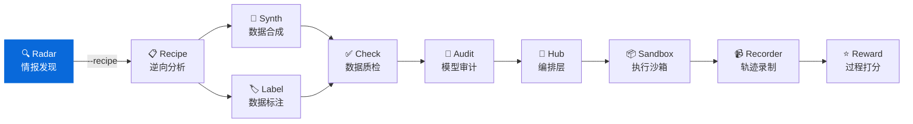

<div align="center">

# AI Dataset Radar

**面向 AI Agent 的训练数据竞争情报系统**
**Competitive intelligence system for AI training datasets**

[](https://github.com/liuxiaotong/ai-dataset-radar/actions/workflows/ci.yml)
[](LICENSE)
[](https://www.python.org/downloads/)
[](#开发路线)
[](docs/agent-integration.md)
[](docs/mcp.md)

[快速开始](#快速开始) · [使用方式](#使用方式) · [数据源](#数据源) · [生态](#生态) · [文档](docs/)

</div>

---

## 亮点

- **全源覆盖** — 86 HF orgs、50 GitHub orgs、71 博客、125 X 账户、arXiv 5 领域
- **智能体原生** — MCP 11 工具 + REST API + Function Calling + Claude Code 7 Skills
- **高性能异步** — aiohttp + asyncio.gather 全链路并发，500+ 请求同时执行
- **双格式输出** — JSON (Agent) + Markdown (人类) + AI 分析报告 (决策层)
- **一键 Recipe** — `--recipe` 自动评分选 Top N 数据集，调用 DataRecipe 深度分析

---

## 快速开始

```bash
git clone https://github.com/liuxiaotong/ai-dataset-radar.git
cd ai-dataset-radar
pip install -r requirements.txt && playwright install chromium
cp .env.example .env  # 编辑填入 Token（GITHUB_TOKEN / ANTHROPIC_API_KEY 等）

# 基础扫描（自动生成 AI 分析报告）
python src/main_intel.py --days 7

# 扫描 + DataRecipe 深度分析
python src/main_intel.py --days 7 --recipe

# Docker
docker compose run scan
```

**产出文件（按日期子目录）：**

```
data/reports/2026-02-08/
├── intel_report_*.json                # 结构化数据 (Agent)
├── intel_report_*.md                  # 原始报告 (人类)
├── intel_report_*_insights_prompt.md  # 分析提示 (LLM 输入)
├── intel_report_*_insights.md         # AI 分析报告 (决策层)
├── intel_report_*_changes.md          # 日报变化追踪
└── recipe/                            # DataRecipe 分析 (--recipe)
```

> 环境变量、RSSHub 配置、Docker 部署、调度设置详见 `.env.example` 和 [系统架构](docs/architecture.md)。

---

## 使用方式

### CLI

```bash
python src/main_intel.py --days 7                  # 基础扫描
python src/main_intel.py --days 7 --recipe          # + DataRecipe
python src/main_intel.py --days 7 --no-insights     # 跳过 AI 分析
python src/main_intel.py --days 7 --api-insights    # 显式调用 LLM API
```

| 环境 | 行为 |
|------|------|
| 默认 | 保存 prompt 文件，由 Claude Code 环境 LLM 分析 |
| `--api-insights` | 调用 LLM API（Anthropic/Kimi/DeepSeek 等）生成 `_insights.md` |
| `--no-insights` | 跳过 insights |

### REST API

```bash
python agent/api.py
# → http://localhost:8080/dashboard（Web 仪表盘）
# → http://localhost:8080/docs（API 文档）
```

核心端点：`/datasets`、`/github`、`/papers`、`/blogs`、`/scan`、`/summary`

> 完整端点列表、代码示例（OpenAI / Anthropic / LangChain）见 [Agent 集成文档](docs/agent-integration.md)。

### MCP Server

```json
{
  "mcpServers": {
    "radar": {
      "command": "uv",
      "args": ["--directory", "/path/to/ai-dataset-radar", "run", "python", "mcp_server/server.py"]
    }
  }
}
```

> 11 个工具（scan/search/diff/trend/history 等）及配置详情见 [MCP 文档](docs/mcp.md)。

### Claude Code Skills

在 Claude Code 中输入 `/` 即可调用，覆盖完整的竞争情报工作流：

| 命令 | 用途 | 类型 | 是否联网 |
|------|------|------|----------|
| `/scan` | 运行扫描 + 自动生成 AI 分析报告 | 采集 | 是 |
| `/brief` | 快速情报简报（5 条发现 + 行动建议） | 阅读 | 否 |
| `/search 关键词` | 跨 5 源搜索（数据集/GitHub/论文/博客/X） | 查询 | 否 |
| `/diff` | 对比两次报告（新增/消失/变化） | 对比 | 否 |
| `/deep-dive 目标` | 组织/数据集/分类深度分析 | 分析 | 否 |
| `/recipe 数据集ID` | DataRecipe 逆向分析（成本/Schema/难度） | 深潜 | 是 |
| `/radar` | 通用情报助手（路由到其他 Skill） | 入口 | — |

**典型工作流：**

```bash
/scan --days 7 --recipe   # 1. 每周采集
/brief                    # 2. 晨会快速浏览
/search RLHF              # 3. 按主题搜索
/deep-dive NVIDIA         # 4. 聚焦某组织
/recipe allenai/Dolci     # 5. 深入某数据集
/diff                     # 6. 周对比变化
```

**设计原则：**

- **环境 LLM 接管**：`ANTHROPIC_API_KEY` 未设置时，`/scan` 让 Claude Code 自身作为分析引擎
- **纯本地读取**：`/brief`、`/search`、`/diff`、`/deep-dive` 不触发网络请求
- **交叉引用**：每个 Skill 的输出中推荐相关的后续 Skill

---

## 数据源

| 来源 | 数量 | 覆盖 |
|------|-----:|------|
| **HuggingFace** | 86 orgs | 67 Labs + 27 供应商（含机器人、欧洲、亚太） |
| **博客** | 71 源 | 实验室 + 研究者 + 独立博客 + 数据供应商 |
| **GitHub** | 50 orgs | AI Labs + 中国开源 + 机器人 + 数据供应商 |
| **论文** | 2 源 | arXiv (cs.CL/AI/LG/CV/RO) + HF Papers |
| **X/Twitter** | 125 账户 | 13 类别，CEO/Leaders + 研究者 + 机器人 |

> 供应商分类、X 账户明细、数据集分类体系见 [数据源文档](docs/data-sources.md)。
> 输出 JSON Schema 见 [输出规范](docs/schema.md)。

---

## 生态



| 层 | 项目 | PyPI&nbsp;包 | 说明 | 仓库 |
|---|---|---|---|---|
| 情报 | **AI&nbsp;Dataset&nbsp;Radar** | knowlyr-radar | 竞争情报、趋势分析 | You&nbsp;are&nbsp;here |
| 分析 | **DataRecipe** | knowlyr-datarecipe | 逆向分析、Schema提取、成本估算 | [GitHub](https://github.com/liuxiaotong/data-recipe) |
| 生产 | **DataSynth** | knowlyr-datasynth | LLM批量合成、种子数据扩充 | [GitHub](https://github.com/liuxiaotong/data-synth) |
| 生产 | **DataLabel** | knowlyr-datalabel | 轻量标注、多标注员合并 | [GitHub](https://github.com/liuxiaotong/data-label) |
| 质检 | **DataCheck** | knowlyr-datacheck | 规则验证、重复检测、分布分析 | [GitHub](https://github.com/liuxiaotong/data-check) |
| 质检 | **ModelAudit** | knowlyr-modelaudit | 蒸馏检测、模型指纹、身份验证 | [GitHub](https://github.com/liuxiaotong/model-audit) |
| Agent | **knowlyr-agent** | knowlyr-sandbox/recorder/reward/hub | 沙箱+录制+Reward+编排 | [GitHub](https://github.com/liuxiaotong/knowlyr-agent) |

> DataRecipe 联动详情（评分公式、输出结构、MCP 双服务配置）见 [DataRecipe 文档](docs/datarecipe.md)。

---

## 开发路线

- [ ] 定时任务与告警

> 已完成里程碑见 [CHANGELOG.md](CHANGELOG.md)。

## 许可证

[MIT](LICENSE)

---

<div align="center">
<sub><a href="https://github.com/liuxiaotong">knowlyr</a> 数据工程生态 · 训练数据竞争情报</sub>
</div>
