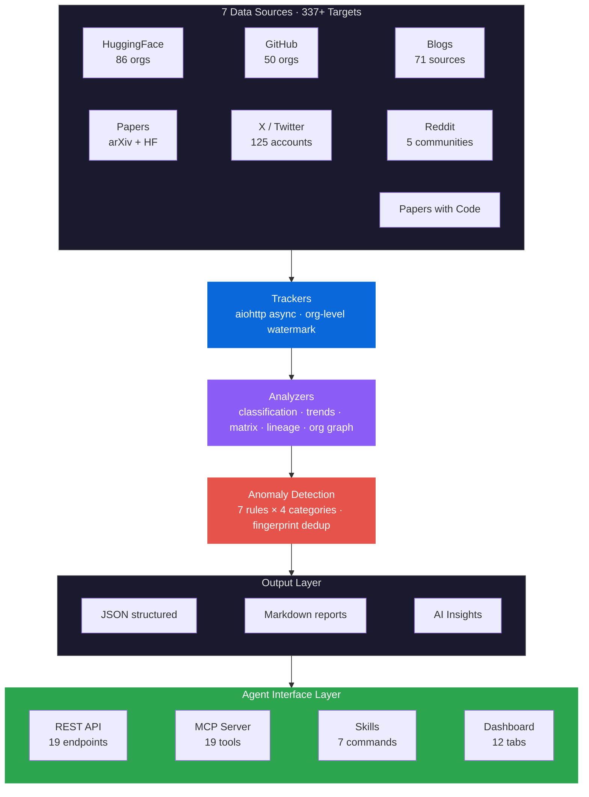
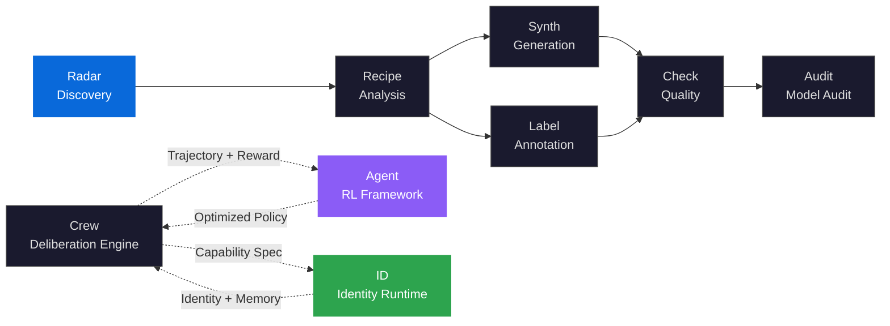

<div align="right">

**English** | [中文](README.zh-CN.md)

</div>

<div align="center">


<br/>

<h1>AI Dataset Radar</h1>

<h3>Multi-Source Competitive Intelligence Engine<br/>for AI Training Data Ecosystems</h3>

<p><strong>Async multi-source intelligence — watermark-driven incremental scanning, anomaly detection, cross-dimensional analysis, agent-native</strong></p>

[](https://pypi.org/project/knowlyr-radar/)
[](https://pypi.org/project/knowlyr-radar/)
[](https://github.com/liuxiaotong/ai-dataset-radar/actions/workflows/ci.yml)
[](https://www.python.org/downloads/)
[](LICENSE)
<br/>
[](#development)
[](#mcp-server)
[](#data-sources)
[](#claude-code-skills)
[](#rest-api--dashboard)
[](#multi-source-async-crawling-engine)

[Abstract](#abstract) · [Problem Statement](#problem-statement) · [Formal Framework](#formal-framework) · [Architecture](#architecture) · [Key Innovations](#key-innovations) · [Quick Start](#quick-start) · [CLI Reference](#cli-reference) · [REST API & Dashboard](#rest-api--dashboard) · [MCP Server](#mcp-server) · [Claude Code Skills](#claude-code-skills) · [Data Sources](#data-sources) · [Ecosystem](#ecosystem) · [References](#references)

</div>

---

## Abstract

Competitive intelligence for AI training data has long been constrained by three fundamental bottlenecks: **information asymmetry**, **source fragmentation**, and **reactive monitoring**. AI Dataset Radar proposes a multi-source asynchronous competitive intelligence engine that achieves full-pipeline concurrent crawling via aiohttp across 7 data sources and 337+ monitored targets (86 HuggingFace orgs / 50 GitHub orgs / 71 blogs / 125 X accounts / 5 Reddit communities / Papers with Code), reduces API call volume from $O(N)$ to $O(\Delta N)$ through org-level watermark incremental scanning, and closes the loop from passive observation to proactive alerting via 7 anomaly detection rules across 4 categories.

The system constructs an automated intelligence pipeline of "**collect -> analyze -> cross-correlate -> detect anomalies -> distribute alerts**", providing three-dimensional cross-analysis capabilities -- competitive matrix, dataset lineage, and org relationship graph -- while exposing a complete agent-native interface layer of 19 MCP tools + 19 REST endpoints + 7 Claude Code Skills.

> **AI Dataset Radar** implements a multi-source async competitive intelligence engine covering 86 HuggingFace orgs, 50 GitHub orgs, 71 blogs, 125 X accounts, 5 Reddit communities, and Papers with Code. The system features org-level watermark incremental scanning that reduces API calls from $O(N)$ to $O(\Delta N)$, anomaly detection with 7 rules across 4 categories, and three-dimensional cross-analysis (competitive matrix, dataset lineage, org relationship graph). It exposes 19 MCP tools, 19 REST endpoints, and 7 Claude Code Skills for agent-native integration.

---

## Problem Statement

Competitive Intelligence (CI) in the AI training data domain faces unique engineering challenges -- data releases are highly decentralized, update frequencies are unpredictable, and cross-source correlations are implicitly embedded in metadata. Traditional approaches based on manual browsing and keyword subscriptions cannot cope with exponentially growing monitoring scope:

| Root Problem | Formal Definition | Limitations of Traditional Approaches | Radar's Approach |
|:---|:---|:---|:---|
| **Information Asymmetry** | Competitor data releases are scattered across HF / GitHub / blogs / papers / social media with no unified view | RSS subscription coverage < 30%; manual browsing efficiency $O(n)$ | Unified collection across 7 sources and 337+ targets via aiohttp full-pipeline concurrency |
| **Source Fragmentation** | The same organization publishes information at different granularities across platforms, lacking cross-correlation | Each platform monitored independently; org-dataset-paper relationships are severed | Competitive matrix + dataset lineage + org relationship graph for three-dimensional cross-analysis |
| **Reactive Monitoring** | Relies on manual periodic checks; anomalous changes (sudden mass releases, competitor movements) cannot be perceived in real time | Daily/weekly report mode with 1-7 day delay | 7 anomaly detection rules across 4 categories with Email + Webhook auto-push |
| **Incremental Efficiency** | Full-scan API quota consumption is proportional to total data volume, preventing sub-hourly scan frequency | Full pull every time, call volume $\propto N$ | Org-level watermark incremental scanning, call volume $\propto \Delta N$ |

> Radar is not yet another RSS aggregator. It is a **proactive competitive intelligence system** for AI training data ecosystems -- multi-source collection, incremental tracking, anomaly alerting, and agent-native integration, transforming "information gathering" into "intelligence output".

---

## Formal Framework

### Multi-Source Intelligence Fusion

Intelligence collection is formalized as a multi-source fusion model. Let $S$ be the set of data sources, where each source $s \in S$ produces a data set $D_s$ within time window $[t - \Delta t, t]$. The global intelligence view is:

$$I(t) = \bigcup_{s \in S} f_s(t, \Delta t)$$

Where $f_s: \mathbb{T} \times \mathbb{T} \to 2^{\mathcal{D}}$ is the source-specific collection function, and $\mathcal{D}$ is the universe of structured dataset metadata. Currently $|S| = 7$, covering $\sum_{s} |targets_s| = 337+$ monitored targets.

### Watermark-Driven Incremental Scanning

Each source $s$ and organization $o$ maintains an independent watermark $W_{s,o}(t)$, representing the latest known timestamp for that organization on that source:

$$W_{s,o}(t) = \max\left\{W_{s,o}(t-1),\ \max_{d \in D_{s,o}} \text{timestamp}(d)\right\}$$

Incremental scanning fetches only data beyond the watermark: $D_{s,o}^{\Delta}(t) = \{d \in D_{s,o} \mid \text{timestamp}(d) > W_{s,o}(t-1)\}$. On first execution $W_{s,o}(0) = -\infty$, triggering a full collection to establish the baseline. API call volume drops from $O(|D|)$ (full scan) to $O(|D^{\Delta}|)$ (incremental), with each organization maintaining an independent window to prevent slow sources from blocking fast ones.

### Anomaly Scoring Function

The anomaly scoring function computes a weighted score for each new data item $d$, triggering an alert threshold:

$$A(d) = \sum_{i=1}^{7} w_i \cdot r_i(d)$$

Where $r_i(d) \in \{0, 1\}$ is the binary decision of the $i$-th rule, and $w_i$ is the rule weight. The 7 rules cover 4 categories:

| Category | Rule | Detection Target |
|:---|:---|:---|
| **Volume** | Sudden mass release | Organization publishes > $\mu + k\sigma$ items within $\Delta t$ |
| **Novelty** | New entrant | Previously unmonitored organization appears for the first time |
| **Category** | Category anomaly | Dataset growth rate in a category deviates from historical trend |
| **Cross-Source** | Cross-source correlation | Same organization active on $\geq 2$ platforms simultaneously |

The fingerprint deduplication function $\text{fingerprint}(d) = \text{hash}(source, org, id)$ ensures no duplicate alerts for the same event.

---

## Architecture


```mermaid
flowchart TD
    subgraph S[" 7 Data Sources · 337+ Targets"]
        direction LR
        S1["HuggingFace<br/>86 orgs"] ~~~ S2["GitHub<br/>50 orgs"] ~~~ S3["Blogs<br/>71 sources"]
        S4["Papers<br/>arXiv + HF"] ~~~ S5["X / Twitter<br/>125 accounts"] ~~~ S6["Reddit<br/>5 communities"]
        S7["Papers with Code"]
    end

    S --> T["Trackers<br/>aiohttp async · org-level watermark"]
    T --> A["Analyzers<br/>classification · trends · matrix · lineage · org graph"]
    A --> D["Anomaly Detection<br/>7 rules × 4 categories · fingerprint dedup"]

    subgraph O[" Output Layer"]
        direction LR
        O1["JSON structured"] ~~~ O2["Markdown reports"] ~~~ O3["AI Insights"]
    end

    D --> O

    subgraph I[" Agent Interface Layer"]
        direction LR
        I1["REST API<br/>19 endpoints"] ~~~ I2["MCP Server<br/>19 tools"] ~~~ I3["Skills<br/>7 commands"] ~~~ I4["Dashboard<br/>12 tabs"]
    end

    O --> I

    style S fill:#1a1a2e,color:#e0e0e0,stroke:#444
    style T fill:#0969da,color:#fff,stroke:#0969da
    style A fill:#8b5cf6,color:#fff,stroke:#8b5cf6
    style D fill:#e5534b,color:#fff,stroke:#e5534b
    style O fill:#1a1a2e,color:#e0e0e0,stroke:#444
    style I fill:#2da44e,color:#fff,stroke:#2da44e
```

### Layered Architecture

| Layer | Module | Responsibility |
|:---|:---|:---|
| **Collection** | Trackers · Watermark Manager | Async collection across 7 sources; org-level watermark incremental scanning; Playwright dynamic rendering |
| **Analysis** | Classifiers · Trend Engine · Matrix Builder | Dataset classification; time-series trend computation; competitive matrix construction |
| **Cross-Analysis** | Lineage · Org Graph · Competitive Matrix | Dataset lineage tracking; org relationship graph; three-dimensional cross-correlation |
| **Detection** | Anomaly Rules · Alert Engine | 7 rules across 4 categories for anomaly detection; fingerprint dedup; Email/Webhook distribution |
| **Persistence** | Time-Series Store · SQLite Snapshots | Bulk upsert + scoped trend computation; daily snapshots |
| **Interface** | REST API · MCP Server · Skills · Dashboard | 19 + 19 + 7 agent interfaces + 12-tab web dashboard |
| **Intelligence** | AI Insights · DataRecipe Integration | LLM-powered analytical report generation; DataRecipe reverse-analysis integration |

---

## Key Innovations

### 1. Multi-Source Async Crawling Engine

Intelligence sources for AI training data are highly dispersed -- labs publish models on HuggingFace, code on GitHub, write-ups on blogs, and signal directions on X/Twitter. Radar achieves full-pipeline concurrent coverage of 7 data sources and 337+ monitored targets via aiohttp:

| Source | Count | Coverage |
|:---|---:|:---|
| **HuggingFace** | 86 orgs | 67 labs + 27 vendors (incl. robotics, Europe, Asia-Pacific) |
| **Blogs** | 71 sources | Labs + researchers + independent blogs + data vendors |
| **GitHub** | 50 orgs | AI labs + Chinese open-source + robotics + data vendors |
| **Papers** | 2 sources | arXiv (cs.CL/AI/LG/CV/RO) + HF Papers |
| **Papers with Code** | API | Dataset/benchmark tracking; paper citation relationships |
| **X/Twitter** | 125 accounts | 13 categories: CEOs/Leaders + researchers + robotics |
| **Reddit** | 5 communities | MachineLearning, LocalLLaMA, dataset, deeplearning, LanguageTechnology |

Fully asynchronous architecture capable of executing 500+ concurrent requests per scan, with collection latency determined by the slowest source rather than the sum of all sources. Playwright is used for blog sources requiring dynamic rendering.

> Vendor taxonomy, X account details, and dataset classification system available in [Data Sources Documentation](docs/data-sources.md). Output JSON Schema available in [Schema Specification](docs/schema.md).

### 2. Watermark-Driven Incremental Scanning

Traditional full-scan API quota consumption is proportional to the total number of datasets, making sub-hourly scan frequency impractical. Radar implements **org-level watermark incremental scanning** -- maintaining an independent incremental window $W_{s,o}(t)$ per source per org:

- First execution automatically performs a full collection to establish the baseline ($W_{s,o}(0) = -\infty$)
- Subsequent scans fetch only incremental data beyond the watermark $D^{\Delta}$
- Each org maintains its own watermark independently, preventing slow sources from blocking fast ones
- API call volume drops from $O(|D|)$ to $O(|D^{\Delta}|)$

```bash
python src/main_intel.py --days 7                  # Incremental scan (watermark-driven)
python src/main_intel.py --full-scan --days 7       # Force full scan (rebuild baseline)
```

### 3. Three-Dimensional Cross-Analysis

A single data source provides only a fragmented perspective. Radar constructs three-dimensional cross-analysis capabilities that reveal the implicit competitive landscape:

| Analysis Dimension | Description | Output |
|:---|:---|:---|
| **Competitive Matrix** | Organization x capability dimension comparison table; identifies differentiated positioning | Structured JSON + Markdown |
| **Dataset Lineage** | Tracks dataset derivation chains (fork / remix / extend) | DAG graph + chain analysis |
| **Org Relationship Graph** | Organizational collaboration network based on shared datasets and citation relationships | Force-directed graph |

The three dimensions cross-correlate: the matrix reveals "who is doing what", lineage reveals "where it came from and where it goes", and the graph reveals "who collaborates with whom".

### 4. Rule-Based Anomaly Detection & Alerting

The core closed loop of an intelligence system lies in transitioning from "passive viewing" to "proactive notification". Radar implements anomaly scoring $A(d) = \sum_i w_i \cdot r_i(d)$ with 7 rules across 4 categories:

- **Sudden mass release** -- Organization publishes an anomalous number of datasets within a short time window (Volume)
- **New entrant** -- Previously unmonitored organization appears in the intelligence scope for the first time (Novelty)
- **Category anomaly** -- Sudden change in dataset count for a category, e.g. RLHF category surge (Category)
- **Cross-source correlation** -- Same organization simultaneously active on multiple platforms: blog + HF + GitHub (Cross-Source)

Fingerprint deduplication prevents duplicate alerts; Email + Webhook dual-channel distribution.

### 5. Time-Series Persistence & Trend Analysis

Bulk upsert + scoped trend computation with SQLite daily snapshots for long-cycle trend analysis:

- Organization activity change curves
- Dataset growth trends by category dimension
- Automated quarterly report generation
- Historical snapshot comparison (`/diff`)

Time-series data persistence upgrades the intelligence system from "snapshot" to "film" -- knowing not just the current state, but answering "what is the trend".

### 6. Agent-Native Interface Layer

Radar exposes three complete interface suites in an agent-native manner, covering the full workflow from automated collection to interactive analysis:

| Interface | Count | Description |
|:---|:---|:---|
| **MCP Server** | 19 tools | scan / search / diff / trend / history / reddit / matrix / lineage / org-graph / alerts / export / subscribe, etc. |
| **REST API** | 19 endpoints | Data query + analysis + operations with Swagger documentation |
| **Claude Code Skills** | 7 commands | `/scan` `/brief` `/search` `/diff` `/deep-dive` `/recipe` `/radar` |

All three interfaces share the same data layer and analysis engine; agents can select the most appropriate interaction protocol for each scenario.

### 7. AI-Powered Insight Generation

After collection and analysis produce structured data, LLMs automatically generate intelligence reports directly consumable by decision-makers:

- Generates analysis prompts based on collection results (`_insights_prompt.md`)
- In Claude Code environments, the ambient LLM performs analysis directly; alternatively invokes external APIs via `--api-insights`
- Multi-provider support: Anthropic / Kimi / DeepSeek
- Outputs Markdown-format AI analytical reports (`_insights.md`), focusing on trend judgment and action recommendations

### 8. Dashboard Real-Time Visualization

12-tab web dashboard providing a real-time panoramic intelligence view:

| Panel | Content |
|:---|:---|
| Overview | Global statistics, latest updates, anomaly alerts |
| Datasets / GitHub / Papers / Blogs / Reddit | Per-source detail browsing and search |
| Competitive Matrix | Competitive comparison matrix |
| Lineage | Dataset lineage tracking |
| Org Graph | Org relationship graph |
| Search | Cross-source full-text search |
| Trends | Time-series trend visualization |

---

## Quick Start

```bash
git clone https://github.com/liuxiaotong/ai-dataset-radar.git
cd ai-dataset-radar
pip install -r requirements.txt && playwright install chromium
cp .env.example .env  # Edit to fill in tokens (GITHUB_TOKEN / ANTHROPIC_API_KEY, etc.)

# Basic scan (auto-generates AI analytical report)
python src/main_intel.py --days 7

# Scan + DataRecipe deep analysis
python src/main_intel.py --days 7 --recipe

# Docker
docker compose run scan
```

**Output files (organized by date subdirectory):**

```
data/reports/2026-02-08/
├── intel_report_*.json                # Structured data (Agent)
├── intel_report_*.md                  # Raw report (Human)
├── intel_report_*_insights_prompt.md  # Analysis prompt (LLM input)
├── intel_report_*_insights.md         # AI analytical report (Decision-maker)
├── intel_report_*_changes.md          # Daily change tracking
└── recipe/                            # DataRecipe analysis (--recipe)
```

> Environment variables, RSSHub configuration, Docker deployment, and scheduling settings are detailed in `.env.example` and [System Architecture](docs/architecture.md).

---

## CLI Reference

```bash
python src/main_intel.py --days 7                  # Incremental scan (full on first run, incremental thereafter)
python src/main_intel.py --days 7 --recipe          # + DataRecipe reverse analysis
python src/main_intel.py --full-scan --days 7       # Force full scan
python src/main_intel.py --days 7 --api-insights    # Explicitly invoke LLM API for insights
```

<details>
<summary>Command Reference</summary>

| Mode | Behavior |
|:---|:---|
| Default | Saves prompt file; ambient Claude Code LLM performs analysis |
| `--api-insights` | Invokes LLM API (Anthropic/Kimi/DeepSeek, etc.) to generate `_insights.md` |
| `--no-insights` | Skips insights generation |

</details>

---

## REST API & Dashboard

```bash
python agent/api.py
# -> http://localhost:8080/dashboard (Web Dashboard)
# -> http://localhost:8080/docs (Swagger API Docs)
```

Core endpoints:

| Category | Endpoints |
|:---|:---|
| Data Query | `/datasets` · `/github` · `/papers` · `/blogs` · `/reddit` |
| Analysis | `/matrix` · `/lineage` · `/org-graph` · `/trends` · `/search` · `/alerts` |
| Operations | `/scan` · `/summary` · `/config` · `/schema` · `/tools` |

> Full endpoint list, code examples (OpenAI / Anthropic / LangChain) available in [Agent Integration Documentation](docs/agent-integration.md).

---

## MCP Server

<details>
<summary>MCP Configuration</summary>

```json
{
  "mcpServers": {
    "radar": {
      "command": "uv",
      "args": ["--directory", "/path/to/ai-dataset-radar", "run", "python", "mcp_server/server.py"]
    }
  }
}
```

</details>

> 19 tools (scan / search / diff / trend / history / reddit / matrix / lineage / org-graph / alerts / export / subscribe, etc.) and configuration details available in [MCP Documentation](docs/mcp.md).

---

## Claude Code Skills

Type `/` in Claude Code to invoke. Covers the complete competitive intelligence workflow:

| Command | Purpose | Type | Network |
|:---|:---|:---|:---|
| `/scan` | Run scan + auto-generate AI analytical report | Collection | Yes |
| `/brief` | Quick intelligence briefing (5 findings + action items) | Read | No |
| `/search keyword` | Cross-7-source search (datasets/GitHub/papers/blogs/X/Reddit/PwC) | Query | No |
| `/diff` | Compare two reports (added/removed/changed) | Compare | No |
| `/deep-dive target` | Organization/dataset/category deep analysis | Analysis | No |
| `/recipe datasetID` | DataRecipe reverse analysis (cost/schema/difficulty) | Deep-dive | Yes |
| `/radar` | General intelligence assistant (routes to other skills) | Entry | -- |

**Typical workflow:**

```bash
/scan --days 7 --recipe   # 1. Weekly collection
/brief                    # 2. Morning standup quick review
/search RLHF              # 3. Topic-based search
/deep-dive NVIDIA         # 4. Focus on an organization
/recipe allenai/Dolci     # 5. Deep-dive into a dataset
/diff                     # 6. Weekly change comparison
```

**Design principles:**

- **Ambient LLM takeover**: When `ANTHROPIC_API_KEY` is not set, `/scan` delegates to Claude Code itself as the analysis engine
- **Pure local reads**: `/brief`, `/search`, `/diff`, `/deep-dive` do not trigger network requests
- **Cross-referencing**: Each skill's output recommends related follow-up skills

---

## Data Sources

| Source | Count | Coverage |
|:---|---:|:---|
| **HuggingFace** | 86 orgs | 67 labs + 27 vendors (incl. robotics, Europe, Asia-Pacific) |
| **Blogs** | 71 sources | Labs + researchers + independent blogs + data vendors |
| **GitHub** | 50 orgs | AI labs + Chinese open-source + robotics + data vendors |
| **Papers** | 2 sources | arXiv (cs.CL/AI/LG/CV/RO) + HF Papers |
| **Papers with Code** | API | Dataset/benchmark tracking; paper citation relationships |
| **X/Twitter** | 125 accounts | 13 categories: CEOs/Leaders + researchers + robotics |
| **Reddit** | 5 communities | MachineLearning, LocalLLaMA, dataset, deeplearning, LanguageTechnology |

> Vendor taxonomy, X account details, and dataset classification system available in [Data Sources Documentation](docs/data-sources.md). Output JSON Schema available in [Schema Specification](docs/schema.md).

---

## Ecosystem

<details>
<summary>Architecture Diagram</summary>


```mermaid
graph LR
    Radar["Radar<br/>Discovery"] --> Recipe["Recipe<br/>Analysis"]
    Recipe --> Synth["Synth<br/>Generation"]
    Recipe --> Label["Label<br/>Annotation"]
    Synth --> Check["Check<br/>Quality"]
    Label --> Check
    Check --> Audit["Audit<br/>Model Audit"]
    Crew["Crew<br/>Deliberation Engine"]
    Agent["Agent<br/>RL Framework"]
    ID["ID<br/>Identity Runtime"]
    Crew -.->|Capability Spec| ID
    ID -.->|Identity + Memory| Crew
    Crew -.->|Trajectory + Reward| Agent
    Agent -.->|Optimized Policy| Crew

    style Radar fill:#0969da,color:#fff,stroke:#0969da
    style ID fill:#2da44e,color:#fff,stroke:#2da44e
    style Agent fill:#8b5cf6,color:#fff,stroke:#8b5cf6
    style Crew fill:#1a1a2e,color:#e0e0e0,stroke:#444
    style Recipe fill:#1a1a2e,color:#e0e0e0,stroke:#444
    style Synth fill:#1a1a2e,color:#e0e0e0,stroke:#444
    style Label fill:#1a1a2e,color:#e0e0e0,stroke:#444
    style Check fill:#1a1a2e,color:#e0e0e0,stroke:#444
    style Audit fill:#1a1a2e,color:#e0e0e0,stroke:#444
```

</details>

| Layer | Project | PyPI | Description | Repo |
|:---|:---|:---|:---|:---|
| Discovery | **Radar** | knowlyr-radar | Multi-source competitive intelligence · incremental scanning · anomaly alerting | You are here |
| Analysis | **DataRecipe** | knowlyr-datarecipe | Reverse analysis, schema extraction, cost estimation | [GitHub](https://github.com/liuxiaotong/data-recipe) |
| Production | **DataSynth** | knowlyr-datasynth | LLM batch synthesis | [GitHub](https://github.com/liuxiaotong/data-synth) |
| Production | **DataLabel** | knowlyr-datalabel | Lightweight annotation | [GitHub](https://github.com/liuxiaotong/data-label) |
| Quality | **DataCheck** | knowlyr-datacheck | Rule validation, dedup detection, distribution analysis | [GitHub](https://github.com/liuxiaotong/data-check) |
| Audit | **ModelAudit** | knowlyr-modelaudit | Distillation detection, model fingerprinting | [GitHub](https://github.com/liuxiaotong/model-audit) |
| Deliberation | **Crew** | knowlyr-crew | Adversarial multi-agent deliberation · persistent memory evolution · MCP-native | [GitHub](https://github.com/liuxiaotong/knowlyr-crew) |
| Identity | **knowlyr-id** | -- | Identity system + AI employee runtime | [GitHub](https://github.com/liuxiaotong/knowlyr-id) |
| Agent Training | **knowlyr-gym** | sandbox/recorder/reward/hub | Gymnasium-style RL framework · process reward model · SFT/DPO/GRPO | [GitHub](https://github.com/liuxiaotong/knowlyr-gym) |

> DataRecipe integration details (scoring formula, output structure, MCP dual-server configuration) available in [DataRecipe Documentation](docs/datarecipe.md).

---

## Development

```bash
git clone https://github.com/liuxiaotong/ai-dataset-radar.git
cd ai-dataset-radar
pip install -r requirements.txt && playwright install chromium
cp .env.example .env

# Run tests (999 test cases)
pytest

# Code formatting + lint
ruff check src/
ruff format src/
```

**Test coverage**: 36 test files, 999 test cases.

**CI**: GitHub Actions with automatic publishing on tag push. Scheduled task (`daily.yml`) supports daily automated scanning.

---

## References

- **Competitive Intelligence** -- Kahaner, L., 1997. *Competitive Intelligence: How to Gather, Analyze, and Use Information to Move Your Business to the Top*. Touchstone
- **OSINT Techniques** -- Bazzell, M., 2023. *Open Source Intelligence Techniques*. IntelTechniques -- reference source for multi-source intelligence collection methodology
- **HuggingFace Hub API** -- HuggingFace, 2023. *Hub Python Library Documentation*. [huggingface.co/docs](https://huggingface.co/docs/huggingface_hub/) -- core API for dataset metadata collection
- **Anomaly Detection** -- Chandola, V. et al., 2009. *Anomaly Detection: A Survey.* ACM Computing Surveys, 41(3) -- theoretical foundation for anomaly detection rule design
- **Papers with Code** -- Stojnic, R. et al., 2020. *Papers with Code: Linking Papers with Code.* [paperswithcode.com](https://paperswithcode.com/) -- data source for paper-dataset-benchmark linkage
- **Incremental Processing** -- Zaharia, M. et al., 2013. *Discretized Streams: Fault-Tolerant Streaming Computation at Scale.* SOSP '13 -- engineering reference for incremental processing and watermark mechanisms
- **Information Fusion** -- Hall, D.L. & Llinas, J., 1997. *An Introduction to Multisensor Data Fusion.* Proceedings of the IEEE, 85(1) -- theoretical framework for multi-source information fusion

---

## License

[MIT](LICENSE)

---

<div align="center">
<sub><a href="https://github.com/liuxiaotong">knowlyr</a> -- multi-source competitive intelligence for AI training data</sub>
</div>

