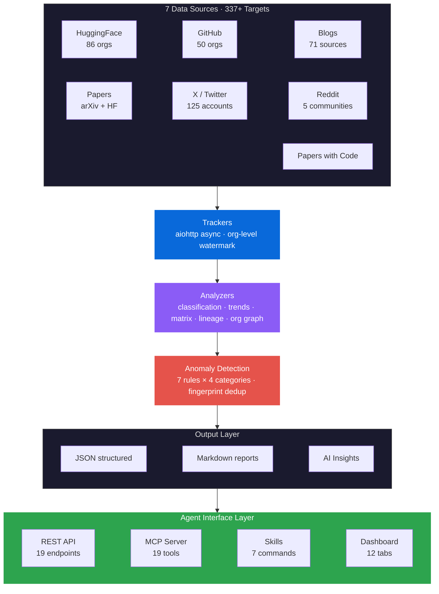
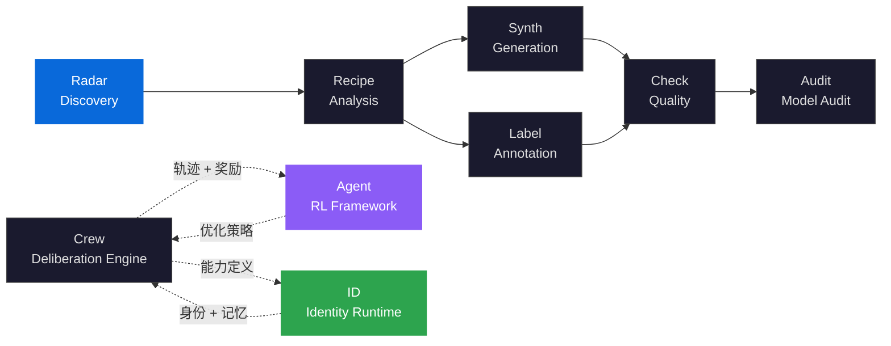

<div align="center">

<h1>AI Dataset Radar</h1>

<h3>Multi-Source Competitive Intelligence Engine<br/>for AI Training Data Ecosystems</h3>

<p><strong>Async multi-source intelligence — watermark-driven incremental scanning, anomaly detection, cross-dimensional analysis, agent-native</strong></p>

<p>
<a href="https://github.com/liuxiaotong/ai-dataset-radar">GitHub</a> · <a href="https://pypi.org/project/knowlyr-radar/">PyPI</a> · <a href="https://knowlyr.com">knowlyr.com</a> · <a href="landing-zh.md">中文版</a>
</p>

</div>

## Abstract

AI 训练数据的竞争情报长期面临**信息不对称** (information asymmetry)、**源碎片化** (source fragmentation) 和**被动式监控** (reactive monitoring) 三重瓶颈。AI Dataset Radar 提出一种多源异步竞争情报引擎：通过 **aiohttp 全链路并发采集** (async full-pipeline crawling) 覆盖 7 大数据源共 337+ 监控目标（86 HF orgs / 50 GitHub orgs / 71 博客 / 125 X 账户 / 5 Reddit / Papers with Code），通过**组织级水位线增量扫描** (org-level watermark incremental scanning) 将 API 调用量从 $O(N)$ 降至 $O(\Delta N)$，通过 **7 条异常检测规则** (anomaly detection rules) 跨 4 类别实现从被动查看到主动告警的闭环。

系统构建「**采集 → 分析 → 交叉关联 → 异常检测 → 告警分发**」的自动化情报管线，提供竞品矩阵 (competitive matrix)、数据集谱系 (dataset lineage)、组织关系图谱 (org relationship graph) 三维交叉分析能力，并以 Agent-native 方式暴露 MCP 19 工具 + REST 19 端点 + Skills 7 命令的完整接口层。

> **AI Dataset Radar** implements a multi-source async competitive intelligence engine covering 86 HuggingFace orgs, 50 GitHub orgs, 71 blogs, 125 X accounts, 5 Reddit communities, and Papers with Code. The system features org-level watermark incremental scanning that reduces API calls from $O(N)$ to $O(\Delta N)$, anomaly detection with 7 rules across 4 categories, and three-dimensional cross-analysis (competitive matrix, dataset lineage, org relationship graph). It exposes 19 MCP tools, 19 REST endpoints, and 7 Claude Code Skills for agent-native integration.

## Problem Statement

竞争情报 (Competitive Intelligence, CI) 在 AI 训练数据领域面临独特的工程挑战——数据发布高度分散、更新频率不可预测、跨源关联关系隐含在元数据中。传统方法以人工浏览 + 关键词订阅为主，无法应对指数增长的监控规模：

| 根本性问题 | 形式化定义 | 传统方法的局限 | Radar 的方法 |
|:---|:---|:---|:---|
| **信息不对称**<br/>Information Asymmetry | 竞争对手的数据发布分散于 HF / GitHub / 博客 / 论文 / 社交媒体，无单一视图 | RSS 订阅覆盖率 < 30%，手动浏览效率 $O(n)$ | 7 源 337+ 目标统一采集，aiohttp 全链路并发 |
| **源碎片化**<br/>Source Fragmentation | 同一组织在不同平台发布不同粒度的信息，缺乏交叉关联 | 各平台独立监控，组织-数据集-论文关系断裂 | 竞品矩阵 + 数据集谱系 + 组织关系图谱三维交叉分析 |
| **被动式监控**<br/>Reactive Monitoring | 依赖人工定期检查，异常变化（突发大量发布、竞品异动）无法实时感知 | 日报/周报模式，延迟 1-7 天 | 7 条异常检测规则 × 4 类别，Email + Webhook 自动推送 |
| **增量效率**<br/>Incremental Efficiency | 全量扫描 API 配额消耗与总数据量成正比，无法提升至小时级频率 | 每次全量拉取，调用量 $\propto N$ | 组织级水位线增量扫描，调用量 $\propto \Delta N$ |

> Radar 不是又一个 RSS 聚合器。它是面向 AI 训练数据生态的**主动式竞争情报系统**——多源采集、增量追踪、异常告警、Agent 原生集成，将"信息搜集"变为"情报输出"。

## Formal Framework

### Multi-Source Intelligence Fusion

情报采集形式化为多源融合模型。设 $S$ 为数据源集合，每个源 $s \in S$ 在时间窗口 $[t - \Delta t, t]$ 内产出数据集合 $D_s$，全局情报视图为：

$$I(t) = \bigcup_{s \in S} f_s(t, \Delta t)$$

其中 $f_s: \mathbb{T} \times \mathbb{T} \to 2^{\mathcal{D}}$ 为源特定的采集函数，$\mathcal{D}$ 为结构化数据集元数据的全集。当前 $|S| = 7$，覆盖 $\sum_{s} |targets_s| = 337+$ 个监控目标。

### Watermark-Driven Incremental Scanning

每个源 $s$ 的每个组织 $o$ 维护独立水位线 $W_{s,o}(t)$，表示该组织在该源上已知的最新时间戳：

$$W_{s,o}(t) = \max\left\{W_{s,o}(t-1),\ \max_{d \in D_{s,o}} \text{timestamp}(d)\right\}$$

增量扫描仅拉取水位线之后的数据：$D_{s,o}^{\Delta}(t) = \{d \in D_{s,o} \mid \text{timestamp}(d) > W_{s,o}(t-1)\}$。首次执行时 $W_{s,o}(0) = -\infty$，自动触发全量采集建立基线。API 调用量从 $O(|D|)$（全量）降至 $O(|D^{\Delta}|)$（增量），每个组织独立窗口避免慢源拖累快源。

### Anomaly Scoring Function

异常评分函数对每条新增数据 $d$ 计算加权得分，触发告警阈值：

$$A(d) = \sum_{i=1}^{7} w_i \cdot r_i(d)$$

其中 $r_i(d) \in \{0, 1\}$ 为第 $i$ 条规则的二值判定，$w_i$ 为规则权重。7 条规则覆盖 4 个类别：

| 类别 | 规则 | 检测目标 |
|:---|:---|:---|
| **Volume** | 突发大量发布 | 组织在 $\Delta t$ 内发布数量 > $\mu + k\sigma$ |
| **Novelty** | 新进入者 | 此前未监控的组织首次出现 |
| **Category** | 分类异动 | 某分类的数据集增速偏离历史趋势 |
| **Cross-Source** | 跨源关联 | 同一组织在 $\geq 2$ 个平台同步活跃 |

指纹去重函数 $\text{fingerprint}(d) = \text{hash}(source, org, id)$ 确保同一事件不重复告警。

## Architecture



### Layered Architecture

| 层 | 模块 | 职责 |
|:---|:---|:---|
| **Collection** | Trackers · Watermark Manager | 7 源异步采集，组织级水位线增量扫描，Playwright 动态渲染 |
| **Analysis** | Classifiers · Trend Engine · Matrix Builder | 数据集分类、时序趋势计算、竞品矩阵构建 |
| **Cross-Analysis** | Lineage · Org Graph · Competitive Matrix | 数据集谱系追踪、组织关系图谱、三维交叉关联 |
| **Detection** | Anomaly Rules · Alert Engine | 7 条规则 × 4 类别异常检测，指纹去重，Email/Webhook 分发 |
| **Persistence** | Time-Series Store · SQLite Snapshots | 批量 upsert + 作用域趋势计算，每日快照 |
| **Interface** | REST API · MCP Server · Skills · Dashboard | 19 + 19 + 7 Agent 接口 + 12 Tab Web 仪表盘 |
| **Intelligence** | AI Insights · DataRecipe Integration | LLM 分析报告生成，DataRecipe 逆向分析联动 |

## Key Innovations

### 1. Multi-Source Async Crawling Engine

AI 训练数据的情报来源高度分散——实验室在 HuggingFace 发模型、在 GitHub 发代码、在博客写解读、在 X/Twitter 预告方向。Radar 通过 aiohttp 全链路并发覆盖 7 大数据源 337+ 监控目标：

| 来源 | 数量 | 覆盖 |
|:---|---:|:---|
| **HuggingFace** | 86 orgs | 67 Labs + 27 供应商（含机器人、欧洲、亚太） |
| **博客** | 71 源 | 实验室 + 研究者 + 独立博客 + 数据供应商 |
| **GitHub** | 50 orgs | AI Labs + 中国开源 + 机器人 + 数据供应商 |
| **论文** | 2 源 | arXiv (cs.CL/AI/LG/CV/RO) + HF Papers |
| **Papers with Code** | API | 数据集/榜单追踪，论文引用关系 |
| **X/Twitter** | 125 账户 | 13 类别，CEO/Leaders + 研究者 + 机器人 |
| **Reddit** | 5 社区 | MachineLearning、LocalLLaMA、dataset、deeplearning、LanguageTechnology |

全异步架构，单次扫描可同时执行 500+ 并发请求，采集延迟由最慢源决定而非源数之和。Playwright 用于需要动态渲染的博客源。

> 供应商分类、X 账户明细、数据集分类体系见 [数据源文档](docs/data-sources.md)。输出 JSON Schema 见 [输出规范](docs/schema.md)。

### 2. Watermark-Driven Incremental Scanning

传统全量扫描的 API 配额消耗与总数据集数成正比，难以提升至小时级频率。Radar 实现**组织级水位线增量扫描**——每源每 org 维护独立的增量窗口 $W_{s,o}(t)$：

- 首次执行自动全量采集，建立基线（$W_{s,o}(0) = -\infty$）
- 后续扫描仅拉取水位线之后的增量数据 $D^{\Delta}$
- 每个 org 独立维护水位线，避免慢源拖累快源
- API 调用量从 $O(|D|)$ 降至 $O(|D^{\Delta}|)$

```bash
python src/main_intel.py --days 7                  # 增量扫描（水位线驱动）
python src/main_intel.py --full-scan --days 7       # 强制全量扫描（重建基线）
```

### 3. Three-Dimensional Cross-Analysis

单一数据源只能提供碎片化视角。Radar 构建三维交叉分析能力，揭示隐含的竞争格局：

| 分析维度 | 说明 | 输出 |
|:---|:---|:---|
| **竞品矩阵** (Competitive Matrix) | 组织 × 能力维度的对比表，识别差异化定位 | 结构化 JSON + Markdown |
| **数据集谱系** (Dataset Lineage) | 追踪数据集的派生关系链 (fork / remix / extend) | DAG 图 + 链路分析 |
| **组织关系图谱** (Org Relationship Graph) | 基于共同数据集、引用关系的组织协作网络 | Force-directed 图 |

三个维度交叉关联：矩阵揭示"谁在做什么"，谱系揭示"从哪来到哪去"，图谱揭示"谁和谁协作"。

### 4. Rule-Based Anomaly Detection & Alerting

情报系统的核心闭环在于从"被动查看"转为"主动通知"。Radar 实现 $A(d) = \sum_i w_i \cdot r_i(d)$ 异常评分，7 条规则覆盖 4 类别：

- **突发大量发布** — 组织在短时间内发布异常数量的数据集（Volume）
- **新进入者** — 此前未监控的组织首次出现在情报视野（Novelty）
- **分类异动** — 某分类的数据集数量突变，如 RLHF 类别激增（Category）
- **跨源关联** — 同一组织在多个平台同步活跃，博客 + HF + GitHub（Cross-Source）

指纹去重避免重复告警，Email + Webhook 双通道分发。

### 5. Time-Series Persistence & Trend Analysis

批量 upsert + 作用域趋势计算，SQLite 每日快照，支持长周期趋势分析：

- 组织活跃度变化曲线
- 分类维度的数据集增长趋势
- 季度报告自动生成
- 历史快照对比（`/diff`）

时序数据持久化使情报系统从"快照"升级为"影片"——不仅知道当前状态，还能回答"变化趋势是什么"。

### 6. Agent-Native Interface Layer

Radar 以 Agent-native 方式暴露三套完整接口，覆盖从自动化采集到交互式分析的全工作流：

| 接口 | 数量 | 说明 |
|:---|:---|:---|
| **MCP Server** | 19 tools | scan / search / diff / trend / history / reddit / matrix / lineage / org-graph / alerts / export / subscribe 等 |
| **REST API** | 19 endpoints | 数据查询 + 分析 + 操作，含 Swagger 文档 |
| **Claude Code Skills** | 7 commands | `/scan` `/brief` `/search` `/diff` `/deep-dive` `/recipe` `/radar` |

三套接口共享同一数据层和分析引擎，Agent 可按场景选择最合适的交互协议。

### 7. AI-Powered Insight Generation

采集和分析产出结构化数据后，LLM 自动生成决策层可直读的情报报告：

- 基于采集结果生成分析提示 (`_insights_prompt.md`)
- Claude Code 环境下直接由环境 LLM 分析，或通过 `--api-insights` 调用外部 API
- 多 Provider 支持：Anthropic / Kimi / DeepSeek
- 输出 Markdown 格式的 AI 分析报告 (`_insights.md`)，聚焦趋势判断和行动建议

### 8. Dashboard Real-Time Visualization

12 Tab Web 仪表盘，实时呈现情报全景：

| 面板 | 内容 |
|:---|:---|
| Overview | 全局统计、最新动态、异常告警 |
| Datasets / GitHub / Papers / Blogs / Reddit | 各源详情浏览与搜索 |
| Competitive Matrix | 竞品对比矩阵 |
| Lineage | 数据集谱系追踪 |
| Org Graph | 组织关系图谱 |
| Search | 跨源全文搜索 |
| Trends | 时序趋势可视化 |

## Quick Start

```bash
git clone https://github.com/liuxiaotong/ai-dataset-radar.git
cd ai-dataset-radar
pip install -r requirements.txt && playwright install chromium
cp .env.example .env  # 编辑填入 Token（GITHUB_TOKEN / ANTHROPIC_API_KEY 等）

# 基础扫描（自动生成 AI 分析报告）
python src/main_intel.py --days 7

# 扫描 + DataRecipe 深度分析
python src/main_intel.py --days 7 --recipe

# Docker
docker compose run scan
```

**产出文件（按日期子目录）：**

```
data/reports/2026-02-08/
├── intel_report_*.json                # 结构化数据 (Agent)
├── intel_report_*.md                  # 原始报告 (人类)
├── intel_report_*_insights_prompt.md  # 分析提示 (LLM 输入)
├── intel_report_*_insights.md         # AI 分析报告 (决策层)
├── intel_report_*_changes.md          # 日报变化追踪
└── recipe/                            # DataRecipe 分析 (--recipe)
```

> 环境变量、RSSHub 配置、Docker 部署、调度设置详见 `.env.example` 和 [系统架构](docs/architecture.md)。

## CLI Reference

```bash
python src/main_intel.py --days 7                  # 增量扫描（首次全量，后续增量）
python src/main_intel.py --days 7 --recipe          # + DataRecipe 逆向分析
python src/main_intel.py --full-scan --days 7       # 强制全量扫描
python src/main_intel.py --days 7 --api-insights    # 显式调用 LLM API 生成 insights
```

<details>
<summary>命令参考</summary>

| 环境 | 行为 |
|:---|:---|
| 默认 | 保存 prompt 文件，由 Claude Code 环境 LLM 分析 |
| `--api-insights` | 调用 LLM API（Anthropic/Kimi/DeepSeek 等）生成 `_insights.md` |
| `--no-insights` | 跳过 insights |

</details>

## REST API & Dashboard

```bash
python agent/api.py
# → http://localhost:8080/dashboard（Web 仪表盘）
# → http://localhost:8080/docs（Swagger API 文档）
```

核心端点：

| 类别 | 端点 |
|:---|:---|
| 数据查询 | `/datasets` · `/github` · `/papers` · `/blogs` · `/reddit` |
| 分析 | `/matrix` · `/lineage` · `/org-graph` · `/trends` · `/search` · `/alerts` |
| 操作 | `/scan` · `/summary` · `/config` · `/schema` · `/tools` |

> 完整端点列表、代码示例（OpenAI / Anthropic / LangChain）见 [Agent 集成文档](docs/agent-integration.md)。

## MCP Server

<details>
<summary>MCP 配置</summary>

```json
{
  "mcpServers": {
    "radar": {
      "command": "uv",
      "args": ["--directory", "/path/to/ai-dataset-radar", "run", "python", "mcp_server/server.py"]
    }
  }
}
```

</details>

> 19 个工具（scan / search / diff / trend / history / reddit / matrix / lineage / org-graph / alerts / export / subscribe 等）及配置详情见 [MCP 文档](docs/mcp.md)。

## Claude Code Skills

在 Claude Code 中输入 `/` 即可调用，覆盖完整的竞争情报工作流：

| 命令 | 用途 | 类型 | 是否联网 |
|:---|:---|:---|:---|
| `/scan` | 运行扫描 + 自动生成 AI 分析报告 | 采集 | 是 |
| `/brief` | 快速情报简报（5 条发现 + 行动建议） | 阅读 | 否 |
| `/search 关键词` | 跨 7 源搜索（数据集/GitHub/论文/博客/X/Reddit/PwC） | 查询 | 否 |
| `/diff` | 对比两次报告（新增/消失/变化） | 对比 | 否 |
| `/deep-dive 目标` | 组织/数据集/分类深度分析 | 分析 | 否 |
| `/recipe 数据集ID` | DataRecipe 逆向分析（成本/Schema/难度） | 深潜 | 是 |
| `/radar` | 通用情报助手（路由到其他 Skill） | 入口 | — |

**典型工作流：**

```bash
/scan --days 7 --recipe   # 1. 每周采集
/brief                    # 2. 晨会快速浏览
/search RLHF              # 3. 按主题搜索
/deep-dive NVIDIA         # 4. 聚焦某组织
/recipe allenai/Dolci     # 5. 深入某数据集
/diff                     # 6. 周对比变化
```

**设计原则：**

- **环境 LLM 接管**：`ANTHROPIC_API_KEY` 未设置时，`/scan` 让 Claude Code 自身作为分析引擎
- **纯本地读取**：`/brief`、`/search`、`/diff`、`/deep-dive` 不触发网络请求
- **交叉引用**：每个 Skill 的输出中推荐相关的后续 Skill

## Data Sources

| 来源 | 数量 | 覆盖 |
|:---|---:|:---|
| **HuggingFace** | 86 orgs | 67 Labs + 27 供应商（含机器人、欧洲、亚太） |
| **博客** | 71 源 | 实验室 + 研究者 + 独立博客 + 数据供应商 |
| **GitHub** | 50 orgs | AI Labs + 中国开源 + 机器人 + 数据供应商 |
| **论文** | 2 源 | arXiv (cs.CL/AI/LG/CV/RO) + HF Papers |
| **Papers with Code** | API | 数据集/榜单追踪，论文引用关系 |
| **X/Twitter** | 125 账户 | 13 类别，CEO/Leaders + 研究者 + 机器人 |
| **Reddit** | 5 社区 | MachineLearning、LocalLLaMA、dataset、deeplearning、LanguageTechnology |

> 供应商分类、X 账户明细、数据集分类体系见 [数据源文档](docs/data-sources.md)。输出 JSON Schema 见 [输出规范](docs/schema.md)。

## Ecosystem

<details>
<summary>Architecture Diagram</summary>



</details>

| Layer | Project | PyPI | Description | Repo |
|:---|:---|:---|:---|:---|
| Discovery | **Radar** | knowlyr-radar | 多源竞争情报 · 增量扫描 · 异常告警 | You are here |
| Analysis | **DataRecipe** | knowlyr-datarecipe | 逆向分析、Schema 提取、成本估算 | [GitHub](https://github.com/liuxiaotong/data-recipe) |
| Production | **DataSynth** | knowlyr-datasynth | LLM 批量合成 | [GitHub](https://github.com/liuxiaotong/data-synth) |
| Production | **DataLabel** | knowlyr-datalabel | 轻量标注 | [GitHub](https://github.com/liuxiaotong/data-label) |
| Quality | **DataCheck** | knowlyr-datacheck | 规则验证、重复检测、分布分析 | [GitHub](https://github.com/liuxiaotong/data-check) |
| Audit | **ModelAudit** | knowlyr-modelaudit | 蒸馏检测、模型指纹 | [GitHub](https://github.com/liuxiaotong/model-audit) |
| Deliberation | **Crew** | knowlyr-crew | 对抗式多智能体协商 · 持久记忆进化 · MCP 原生 | [GitHub](https://github.com/liuxiaotong/knowlyr-crew) |
| Identity | **knowlyr-id** | — | 身份系统 + AI 员工运行时 | [GitHub](https://github.com/liuxiaotong/knowlyr-id) |
| Agent Training | **knowlyr-gym** | sandbox/recorder/reward/hub | Gymnasium 风格 RL 框架 · 过程奖励模型 · SFT/DPO/GRPO | [GitHub](https://github.com/liuxiaotong/knowlyr-gym) |

> DataRecipe 联动详情（评分公式、输出结构、MCP 双服务配置）见 [DataRecipe 文档](docs/datarecipe.md)。

## References

- **Competitive Intelligence** — Kahaner, L., 1997. *Competitive Intelligence: How to Gather, Analyze, and Use Information to Move Your Business to the Top*. Touchstone
- **OSINT Techniques** — Bazzell, M., 2023. *Open Source Intelligence Techniques*. IntelTechniques — 多源情报采集方法论的参考来源
- **HuggingFace Hub API** — HuggingFace, 2023. *Hub Python Library Documentation*. [huggingface.co/docs](https://huggingface.co/docs/huggingface_hub/) — 数据集元数据采集的核心 API
- **Anomaly Detection** — Chandola, V. et al., 2009. *Anomaly Detection: A Survey.* ACM Computing Surveys, 41(3) — 异常检测规则设计的理论基础
- **Papers with Code** — Stojnic, R. et al., 2020. *Papers with Code: Linking Papers with Code.* [paperswithcode.com](https://paperswithcode.com/) — 论文-数据集-榜单关联的数据源
- **Incremental Processing** — Zaharia, M. et al., 2013. *Discretized Streams: Fault-Tolerant Streaming Computation at Scale.* SOSP '13 — 增量处理与水位线机制的工程参考
- **Information Fusion** — Hall, D.L. & Llinas, J., 1997. *An Introduction to Multisensor Data Fusion.* Proceedings of the IEEE, 85(1) — 多源信息融合的理论框架

<div align="center">
<sub><a href="https://github.com/liuxiaotong">knowlyr</a> — multi-source competitive intelligence for AI training data</sub>
</div>
