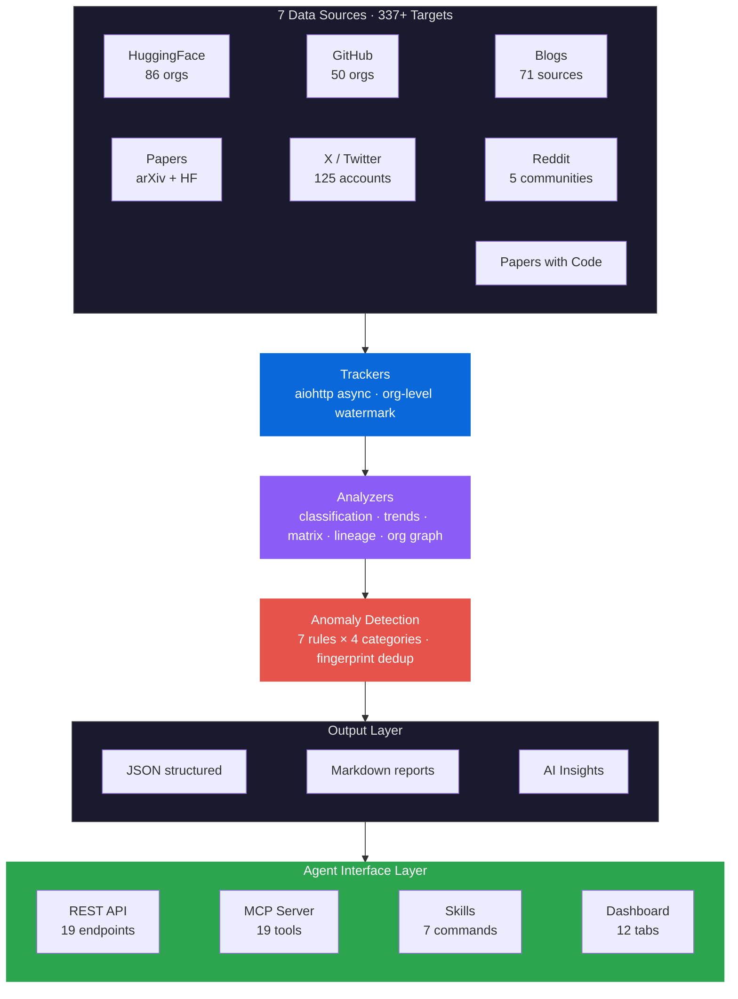

<div align="center">

<h1>AI Dataset Radar</h1>

<h3>Multi-Source Competitive Intelligence Engine<br/>for AI Training Data Ecosystems</h3>

<p><strong>Async multi-source intelligence — watermark-driven incremental scanning, anomaly detection, cross-dimensional analysis, agent-native</strong></p>

<p>
<a href="https://github.com/liuxiaotong/ai-dataset-radar">GitHub</a> · <a href="https://pypi.org/project/knowlyr-radar/">PyPI</a> · <a href="https://knowlyr.com">knowlyr.com</a> · <a href="landing-zh.md">中文版</a>
</p>

</div>

## Abstract

Competitive intelligence for AI training data has long been constrained by three fundamental bottlenecks: **information asymmetry**, **source fragmentation**, and **reactive monitoring**. AI Dataset Radar proposes a multi-source asynchronous competitive intelligence engine that achieves full-pipeline concurrent crawling via aiohttp across 7 data sources and 337+ monitored targets (86 HuggingFace orgs / 50 GitHub orgs / 71 blogs / 125 X accounts / 5 Reddit communities / Papers with Code), reduces API call volume from $O(N)$ to $O(\Delta N)$ through org-level watermark incremental scanning, and closes the loop from passive observation to proactive alerting via 7 anomaly detection rules across 4 categories.

> **AI Dataset Radar** implements a multi-source async competitive intelligence engine covering 86 HuggingFace orgs, 50 GitHub orgs, 71 blogs, 125 X accounts, 5 Reddit communities, and Papers with Code. The system features org-level watermark incremental scanning that reduces API calls from $O(N)$ to $O(\Delta N)$, anomaly detection with 7 rules across 4 categories, and three-dimensional cross-analysis (competitive matrix, dataset lineage, org relationship graph). It exposes 19 MCP tools, 19 REST endpoints, and 7 Claude Code Skills for agent-native integration.

## Architecture


```mermaid
flowchart TD
    subgraph S[" 7 Data Sources · 337+ Targets"]
        direction LR
        S1["HuggingFace<br/>86 orgs"] ~~~ S2["GitHub<br/>50 orgs"] ~~~ S3["Blogs<br/>71 sources"]
        S4["Papers<br/>arXiv + HF"] ~~~ S5["X / Twitter<br/>125 accounts"] ~~~ S6["Reddit<br/>5 communities"]
        S7["Papers with Code"]
    end

    S --> T["Trackers<br/>aiohttp async · org-level watermark"]
    T --> A["Analyzers<br/>classification · trends · matrix · lineage · org graph"]
    A --> D["Anomaly Detection<br/>7 rules × 4 categories · fingerprint dedup"]

    subgraph O[" Output Layer"]
        direction LR
        O1["JSON structured"] ~~~ O2["Markdown reports"] ~~~ O3["AI Insights"]
    end

    D --> O

    subgraph I[" Agent Interface Layer"]
        direction LR
        I1["REST API<br/>19 endpoints"] ~~~ I2["MCP Server<br/>19 tools"] ~~~ I3["Skills<br/>7 commands"] ~~~ I4["Dashboard<br/>12 tabs"]
    end

    O --> I

    style S fill:#1a1a2e,color:#e0e0e0,stroke:#444
    style T fill:#0969da,color:#fff,stroke:#0969da
    style A fill:#8b5cf6,color:#fff,stroke:#8b5cf6
    style D fill:#e5534b,color:#fff,stroke:#e5534b
    style O fill:#1a1a2e,color:#e0e0e0,stroke:#444
    style I fill:#2da44e,color:#fff,stroke:#2da44e
```

## Key Features

| Feature | Description |
|:---|:---|
| **Multi-Source Async Crawling** | 7 sources, 337+ targets via aiohttp full-pipeline concurrency; 500+ concurrent requests per scan |
| **Watermark Incremental Scanning** | Org-level watermark per source; API calls from $O(N)$ to $O(\Delta N)$ |
| **Three-Dimensional Cross-Analysis** | Competitive matrix + dataset lineage + org relationship graph |
| **Anomaly Detection & Alerting** | 7 rules across 4 categories; fingerprint dedup; Email + Webhook distribution |
| **Time-Series Persistence** | SQLite daily snapshots; bulk upsert; long-cycle trend analysis |
| **Agent-Native Interfaces** | 19 MCP tools + 19 REST endpoints + 7 Claude Code Skills |
| **AI-Powered Insights** | LLM-generated analytical reports; multi-provider (Anthropic / Kimi / DeepSeek) |
| **Real-Time Dashboard** | 12-tab web dashboard with panoramic intelligence view |

## Quick Start

```bash
git clone https://github.com/liuxiaotong/ai-dataset-radar.git
cd ai-dataset-radar
pip install -r requirements.txt && playwright install chromium
cp .env.example .env  # Edit to fill in tokens

# Basic scan (auto-generates AI analytical report)
python src/main_intel.py --days 7

# Scan + DataRecipe deep analysis
python src/main_intel.py --days 7 --recipe

# Docker
docker compose run scan
```

## Data Sources

| Source | Count | Coverage |
|:---|---:|:---|
| **HuggingFace** | 86 orgs | 67 labs + 27 vendors (incl. robotics, Europe, Asia-Pacific) |
| **Blogs** | 71 sources | Labs + researchers + independent blogs + data vendors |
| **GitHub** | 50 orgs | AI labs + Chinese open-source + robotics + data vendors |
| **Papers** | 2 sources | arXiv (cs.CL/AI/LG/CV/RO) + HF Papers |
| **Papers with Code** | API | Dataset/benchmark tracking; paper citation relationships |
| **X/Twitter** | 125 accounts | 13 categories: CEOs/Leaders + researchers + robotics |
| **Reddit** | 5 communities | MachineLearning, LocalLLaMA, dataset, deeplearning, LanguageTechnology |

## Ecosystem

| Layer | Project | PyPI | Description | Repo |
|:---|:---|:---|:---|:---|
| Discovery | **Radar** | knowlyr-radar | Multi-source competitive intelligence · incremental scanning · anomaly alerting | You are here |
| Analysis | **DataRecipe** | knowlyr-datarecipe | Reverse analysis, schema extraction, cost estimation | [GitHub](https://github.com/liuxiaotong/data-recipe) |
| Production | **DataSynth** | knowlyr-datasynth | LLM batch synthesis | [GitHub](https://github.com/liuxiaotong/data-synth) |
| Production | **DataLabel** | knowlyr-datalabel | Lightweight annotation | [GitHub](https://github.com/liuxiaotong/data-label) |
| Quality | **DataCheck** | knowlyr-datacheck | Rule validation, dedup detection, distribution analysis | [GitHub](https://github.com/liuxiaotong/data-check) |
| Audit | **ModelAudit** | knowlyr-modelaudit | Distillation detection, model fingerprinting | [GitHub](https://github.com/liuxiaotong/model-audit) |
| Deliberation | **Crew** | knowlyr-crew | Adversarial multi-agent deliberation · persistent memory evolution · MCP-native | [GitHub](https://github.com/liuxiaotong/knowlyr-crew) |
| Identity | **knowlyr-id** | -- | Identity system + AI employee runtime | [GitHub](https://github.com/liuxiaotong/knowlyr-id) |
| Agent Training | **knowlyr-gym** | sandbox/recorder/reward/hub | Gymnasium-style RL framework · process reward model · SFT/DPO/GRPO | [GitHub](https://github.com/liuxiaotong/knowlyr-gym) |

---

<div align="center">
<sub><a href="https://github.com/liuxiaotong">knowlyr</a> -- multi-source competitive intelligence for AI training data</sub>
</div>
