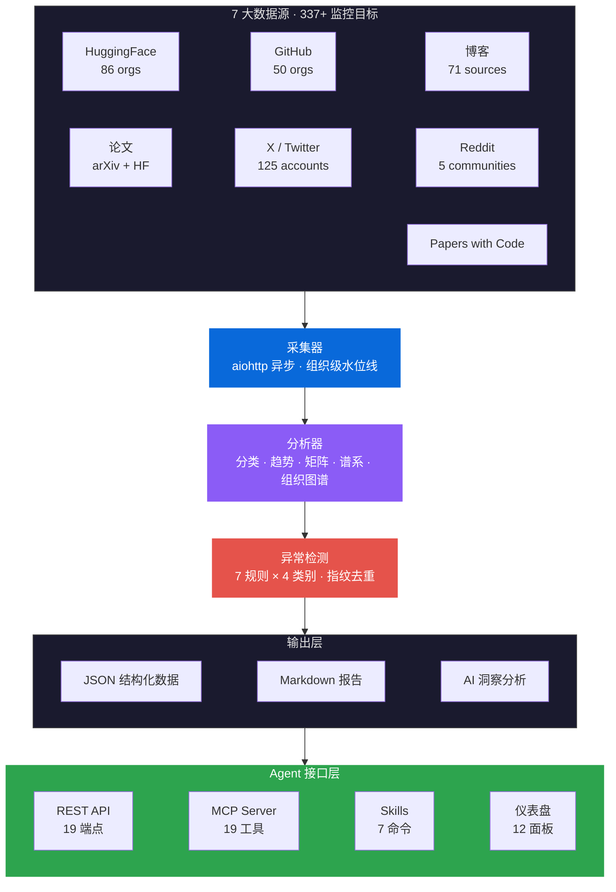

<div align="center">

<h1>AI Dataset Radar</h1>

<h3>面向 AI 训练数据生态的多源竞争情报引擎</h3>

<p><strong>多源异步竞争情报引擎 — 增量水位线扫描 · 异常检测告警 · 三维交叉分析 · Agent 原生</strong></p>

<p>
<a href="https://github.com/liuxiaotong/ai-dataset-radar">GitHub</a> · <a href="https://pypi.org/project/knowlyr-radar/">PyPI</a> · <a href="https://knowlyr.com">knowlyr.com</a> · <a href="landing-en.md">English</a>
</p>

</div>

## 摘要

AI 训练数据的竞争情报长期面临**信息不对称**、**源碎片化**和**被动式监控**三重瓶颈。AI Dataset Radar 提出一种多源异步竞争情报引擎：通过 **aiohttp 全链路并发采集**覆盖 7 大数据源共 337+ 监控目标（86 HF orgs / 50 GitHub orgs / 71 博客 / 125 X 账户 / 5 Reddit / Papers with Code），通过**组织级水位线增量扫描**将 API 调用量从 $O(N)$ 降至 $O(\Delta N)$，通过 **7 条异常检测规则**跨 4 类别实现从被动查看到主动告警的闭环。

> **AI Dataset Radar** 实现了一个多源异步竞争情报引擎，覆盖 86 个 HuggingFace 组织、50 个 GitHub 组织、71 个博客、125 个 X 账户、5 个 Reddit 社区以及 Papers with Code。系统特色包括组织级水位线增量扫描（将 API 调用量从 $O(N)$ 降至 $O(\Delta N)$）、4 类别 7 条规则的异常检测，以及三维交叉分析（竞品矩阵、数据集谱系、组织关系图谱）。对外暴露 19 个 MCP 工具、19 个 REST 端点和 7 个 Claude Code Skills，实现 Agent 原生集成。

## 系统架构



## 核心特性

| 特性 | 说明 |
|:---|:---|
| **多源异步采集** | 7 源 337+ 目标，aiohttp 全链路并发，单次扫描 500+ 并发请求 |
| **水位线增量扫描** | 每源每组织独立水位线，API 调用量从 $O(N)$ 降至 $O(\Delta N)$ |
| **三维交叉分析** | 竞品矩阵 + 数据集谱系 + 组织关系图谱 |
| **异常检测与告警** | 7 条规则 × 4 类别，指纹去重，Email + Webhook 分发 |
| **时序持久化** | SQLite 每日快照，批量 upsert，长周期趋势分析 |
| **Agent 原生接口** | 19 MCP 工具 + 19 REST 端点 + 7 Claude Code Skills |
| **AI 驱动洞察** | LLM 自动生成分析报告，多 Provider（Anthropic / Kimi / DeepSeek） |
| **实时仪表盘** | 12 面板 Web 仪表盘，情报全景呈现 |

## 快速开始

```bash
git clone https://github.com/liuxiaotong/ai-dataset-radar.git
cd ai-dataset-radar
pip install -r requirements.txt && playwright install chromium
cp .env.example .env  # 编辑填入 Token

# 基础扫描（自动生成 AI 分析报告）
python src/main_intel.py --days 7

# 扫描 + DataRecipe 深度分析
python src/main_intel.py --days 7 --recipe

# Docker
docker compose run scan
```

## 数据源

| 来源 | 数量 | 覆盖范围 |
|:---|---:|:---|
| **HuggingFace** | 86 orgs | 67 个实验室 + 27 个供应商（含机器人、欧洲、亚太） |
| **博客** | 71 源 | 实验室 + 研究者 + 独立博客 + 数据供应商 |
| **GitHub** | 50 orgs | AI 实验室 + 中国开源 + 机器人 + 数据供应商 |
| **论文** | 2 源 | arXiv (cs.CL/AI/LG/CV/RO) + HF Papers |
| **Papers with Code** | API | 数据集/榜单追踪，论文引用关系 |
| **X/Twitter** | 125 账户 | 13 类别，CEO/Leaders + 研究者 + 机器人 |
| **Reddit** | 5 社区 | MachineLearning、LocalLLaMA、dataset、deeplearning、LanguageTechnology |

## 生态系统

| 层 | 项目 | PyPI | 描述 | 仓库 |
|:---|:---|:---|:---|:---|
| 发现 | **Radar** | knowlyr-radar | 多源竞争情报 · 增量扫描 · 异常告警 | 当前项目 |
| 分析 | **DataRecipe** | knowlyr-datarecipe | 逆向分析、Schema 提取、成本估算 | [GitHub](https://github.com/liuxiaotong/data-recipe) |
| 生产 | **DataSynth** | knowlyr-datasynth | LLM 批量合成 | [GitHub](https://github.com/liuxiaotong/data-synth) |
| 生产 | **DataLabel** | knowlyr-datalabel | 轻量标注 | [GitHub](https://github.com/liuxiaotong/data-label) |
| 质量 | **DataCheck** | knowlyr-datacheck | 规则验证、重复检测、分布分析 | [GitHub](https://github.com/liuxiaotong/data-check) |
| 审计 | **ModelAudit** | knowlyr-modelaudit | 蒸馏检测、模型指纹 | [GitHub](https://github.com/liuxiaotong/model-audit) |
| 协商 | **Crew** | knowlyr-crew | 对抗式多智能体协商 · 持久记忆进化 · MCP 原生 | [GitHub](https://github.com/liuxiaotong/knowlyr-crew) |
| 身份 | **knowlyr-id** | — | 身份系统 + AI 员工运行时 | [GitHub](https://github.com/liuxiaotong/knowlyr-id) |
| Agent 训练 | **knowlyr-gym** | sandbox/recorder/reward/hub | Gymnasium 风格 RL 框架 · 过程奖励模型 · SFT/DPO/GRPO | [GitHub](https://github.com/liuxiaotong/knowlyr-gym) |

---

<div align="center">
<sub><a href="https://github.com/liuxiaotong">knowlyr</a> — 面向 AI 训练数据的多源竞争情报引擎</sub>
</div>
